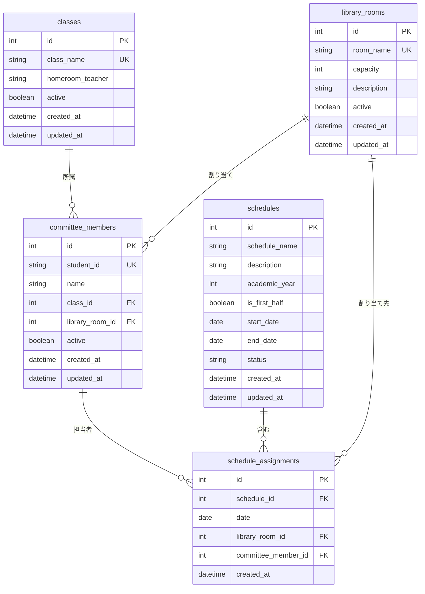

# 図書委員当番割り当てシステム - データベース設計書

## 1. 概要

本書は図書委員当番割り当てシステム第一フェーズのデータベース設計について記述します。システムで使用するテーブル構造、関連性、インデックス設計を定義します。

## 2. データベース環境

- **RDBMS**: SQLite 3.x (開発環境), PostgreSQL 15.x (本番環境)
- **文字エンコーディング**: UTF-8
- **照合順序**: ja-JP.utf8

## 3. テーブル設計

### 3.1 コアテーブル

#### 3.1.1 classes (クラステーブル)

| カラム名 | データ型 | NULL | 主キー | 外部キー | デフォルト | 説明 |
|----------|----------|------|--------|----------|------------|------|
| id | INTEGER | NO | YES | | AUTOINCREMENT | クラスID（主キー） |
| class_name | TEXT | NO | | | | クラス名（例："1A", "2B"） |
| homeroom_teacher | TEXT | YES | | | | 担任教師名 |
| active | BOOLEAN | NO | | | TRUE | アクティブ状態フラグ |
| created_at | DATETIME | NO | | | CURRENT_TIMESTAMP | 作成日時 |
| updated_at | DATETIME | NO | | | CURRENT_TIMESTAMP | 更新日時 |

**インデックス**:
- PRIMARY KEY (id)
- UNIQUE INDEX idx_classes_name (class_name)

#### 3.1.2 committee_members (図書委員テーブル)

| カラム名 | データ型 | NULL | 主キー | 外部キー | デフォルト | 説明 |
|----------|----------|------|--------|----------|------------|------|
| id | INTEGER | NO | YES | | AUTOINCREMENT | 図書委員ID（主キー） |
| student_id | TEXT | NO | | | | 学籍番号 |
| name | TEXT | NO | | | | 生徒名 |
| class_id | INTEGER | NO | | classes.id | | クラスID（外部キー） |
| library_room_id | INTEGER | NO | | library_rooms.id | | 所属図書室ID |
| active | BOOLEAN | NO | | | TRUE | アクティブ状態フラグ |
| created_at | DATETIME | NO | | | CURRENT_TIMESTAMP | 作成日時 |
| updated_at | DATETIME | NO | | | CURRENT_TIMESTAMP | 更新日時 |

**インデックス**:
- PRIMARY KEY (id)
- UNIQUE INDEX idx_committee_members_student_id (student_id)
- INDEX idx_committee_members_class_id (class_id)
- INDEX idx_committee_members_library_room_id (library_room_id)

**外部キー制約**:
- class_id REFERENCES classes(id) ON DELETE RESTRICT
- library_room_id REFERENCES library_rooms(id) ON DELETE RESTRICT

#### 3.1.3 library_rooms (図書室テーブル)

| カラム名 | データ型 | NULL | 主キー | 外部キー | デフォルト | 説明 |
|----------|----------|------|--------|----------|------------|------|
| id | INTEGER | NO | YES | | AUTOINCREMENT | 図書室ID（主キー） |
| room_name | TEXT | NO | | | | 図書室名（例："第一図書室", "第二図書室"） |
| capacity | INTEGER | NO | | | 1 | 1日の最大収容人数 |
| description | TEXT | YES | | | | 図書室の説明 |
| active | BOOLEAN | NO | | | TRUE | アクティブ状態フラグ |
| created_at | DATETIME | NO | | | CURRENT_TIMESTAMP | 作成日時 |
| updated_at | DATETIME | NO | | | CURRENT_TIMESTAMP | 更新日時 |

**インデックス**:
- PRIMARY KEY (id)
- UNIQUE INDEX idx_library_rooms_name (room_name)

#### 3.1.4 schedules (スケジュールテーブル)

| カラム名 | データ型 | NULL | 主キー | 外部キー | デフォルト | 説明 |
|----------|----------|------|--------|----------|------------|------|
| id | INTEGER | NO | YES | | AUTOINCREMENT | スケジュールID（主キー） |
| schedule_name | TEXT | NO | | | | スケジュール名 |
| description | TEXT | YES | | | | スケジュールの説明 |
| academic_year | INTEGER | NO | | | | 学年度（例：2025） |
| is_first_half | BOOLEAN | NO | | | TRUE | 前期（TRUE）または後期（FALSE） |
| start_date | DATE | NO | | | | スケジュール開始日 |
| end_date | DATE | NO | | | | スケジュール終了日 |
| status | TEXT | NO | | | 'draft' | ステータス: 'draft', 'active', 'completed' |
| created_at | DATETIME | NO | | | CURRENT_TIMESTAMP | 作成日時 |
| updated_at | DATETIME | NO | | | CURRENT_TIMESTAMP | 更新日時 |

**インデックス**:
- PRIMARY KEY (id)
- INDEX idx_schedules_academic_year (academic_year)
- INDEX idx_schedules_status (status)
- INDEX idx_schedules_dates (start_date, end_date)

#### 3.1.5 schedule_assignments (スケジュール割り当てテーブル)

| カラム名 | データ型 | NULL | 主キー | 外部キー | デフォルト | 説明 |
|----------|----------|------|--------|----------|------------|------|
| id | INTEGER | NO | YES | | AUTOINCREMENT | 割り当てID（主キー） |
| schedule_id | INTEGER | NO | | schedules.id | | スケジュールID（外部キー） |
| date | DATE | NO | | | | 割り当て日 |
| library_room_id | INTEGER | NO | | library_rooms.id | | 図書室ID（外部キー） |
| committee_member_id | INTEGER | NO | | committee_members.id | | 図書委員ID（外部キー） |
| created_at | DATETIME | NO | | | CURRENT_TIMESTAMP | 作成日時 |

**インデックス**:
- PRIMARY KEY (id)
- UNIQUE INDEX idx_assignments_unique (schedule_id, date, library_room_id, committee_member_id)
- INDEX idx_assignments_schedule_id (schedule_id)
- INDEX idx_assignments_date (date)
- INDEX idx_assignments_library_room_id (library_room_id)
- INDEX idx_assignments_committee_member_id (committee_member_id)

**外部キー制約**:
- schedule_id REFERENCES schedules(id) ON DELETE CASCADE
- library_room_id REFERENCES library_rooms(id) ON DELETE RESTRICT
- committee_member_id REFERENCES committee_members(id) ON DELETE RESTRICT

## 4. テーブル関連性

### 4.1 エンティティ関係図（ER図）



## 5. ビジネスルールと制約

### 5.1 データ整合性ルール

1. **クラス管理**
   - クラス名は一意である必要がある
   - アクティブな図書委員が所属している場合、アクティブなクラスは削除できない

2. **図書委員管理**
   - 学籍番号は一意である必要がある
   - 図書委員は必ず1つのクラスに所属する
   - 図書委員は必ず1つの図書室に配属される
   - 今後の当番予定があるアクティブな図書委員は削除できない

3. **図書室管理**
   - 図書室名は一意である必要がある
   - 収容人数は正の整数である必要がある
   - アクティブな図書委員や今後の当番予定があるアクティブな図書室は削除できない

4. **スケジュール管理**
   - スケジュール日付は有効である必要がある（start_date <= end_date）
   - 同一学年度・学期につき、アクティブなスケジュールは1つのみ
   - 当番割り当てがあるスケジュールは削除できない

5. **当番割り当て管理**
   - 同一日に同一図書委員の重複当番は不可
   - 図書室の収容人数制約を尊重する必要がある
   - 非アクティブな図書委員や図書室への当番割り当ては不可

### 5.2 ビジネスロジック制約

1. **当番割り当て分散**
   - 月曜日、火曜日、木曜日：各図書室1名
   - 水曜日、金曜日：各図書室2名（収容人数が許可する場合）
   - アクティブな図書委員間での公平な当番分散

2. **日付制約**
   - 平日のみの当番割り当て（月曜日〜金曜日）
   - 祝日や学校休暇日には当番なし
   - スケジュール期間内のみの当番割り当て

## 6. サンプルデータ

### 6.1 初期セットアップデータ

```sql
-- クラステーブル初期データ
INSERT INTO classes (class_name, homeroom_teacher) VALUES
('1A', '田中先生'),
('1B', '佐藤先生'),
('2A', '山田先生'),
('2B', '鈴木先生');

-- 図書室テーブル初期データ
INSERT INTO library_rooms (room_name, capacity, description) VALUES
('第一図書室', 2, 'メイン図書室'),
('第二図書室', 1, 'サブ図書室');

-- 図書委員テーブル初期データ
INSERT INTO committee_members (student_id, name, class_id, library_room_id) VALUES
('S001', '田中太郎', 1, 1),
('S002', '佐藤花子', 1, 2),
('S003', '山田次郎', 2, 1),
('S004', '鈴木美咲', 2, 2),
('S005', '高橋健太', 3, 1),
('S006', '伊藤美香', 3, 2),
('S007', '渡辺大輔', 4, 1),
('S008', '中村綾乃', 4, 2);
```

## 7. パフォーマンス考慮事項

### 7.1 クエリ最適化

1. **頻繁に使用されるクエリ**
   - 日付範囲による当番検索
   - 図書室別の図書委員検索
   - スケジュールステータス検索

2. **インデックス戦略**
   - 複数カラムのWHERE句用の複合インデックス
   - 頻繁に選択されるカラム用のカバリングインデックス
   - フィルタリングクエリ用の部分インデックス（アクティブレコードのみ）

### 7.2 メンテナンス

1. **定期メンテナンスタスク**
   - 完了したスケジュールの年次アーカイブ
   - クエリ最適化のための統計更新
   - 低速クエリのパフォーマンス監視

2. **データクリーンアップ**
   - 履歴データ保存のためのソフト削除パターン
   - 30日以上経過したドラフトスケジュールの自動クリーンアップ

## 8. マイグレーション戦略

### 8.1 バージョン管理

- マイグレーションファイルを使用したデータベーススキーマバージョン管理
- 失敗したマイグレーションのロールバック手順
- 環境固有のマイグレーション追跡

### 8.2 データマイグレーション

- スキーマ変更前のバックアップ手順
- マイグレーション後のデータ検証
- 大規模データセットの段階的マイグレーション

## 関連ドキュメント

- [システム設計書](./system_design.md)
- [実装計画書](./implementation_plan.md)
- [テスト戦略書](./test_strategy.md)

---

**文書作成日**: 2025年5月25日  
**最終更新日**: 2025年5月25日  
**作成者**: 開発チーム
