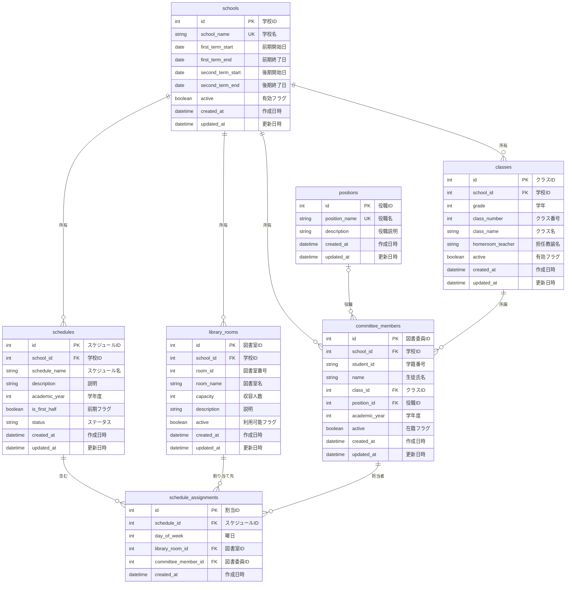

# 図書委員当番割り当てシステム - データベース設計書

## 1. 概要

本書は図書委員当番割り当てシステム第一フェーズのデータベース設計について記述します。システムで使用するテーブル構造、関連性、インデックス設計を定義します。

## 2. データベース環境

- **RDBMS**: SQLite 3.x (開発環境), PostgreSQL 15.x (Supabase 本番環境)
- **文字エンコーディング**: UTF-8
- **照合順序**: ja-JP.utf8

## 3. テーブル設計

### 3.1 テーブル一覧

| 物理名 | 論理名 | 説明 |
|--------|--------|------|
| schools | 学校マスタ | 学校の基本情報（学期期間、アクティブ状態など）を管理 |
| positions | 役職マスタ | 図書委員の役職情報を管理（委員長、副委員長など） |
| classes | クラスマスタ | 学校のクラス情報（学年・組・担任名）を管理 |
| committee_members | 図書委員マスタ | 図書委員の基本情報と所属クラスを管理 |
| library_rooms | 図書室マスタ | 図書室の情報（収容人数、説明など）を管理 |
| schedules | スケジュールマスタ | 当番スケジュールの基本情報（期間、ステータスなど）を管理 |
| schedule_assignments | スケジュール割当 | 委員ごとの日次・時間帯ごとの割り当て情報を管理 |

### 3.2 コアテーブル

#### 3.1.1 schools (学校テーブル)

| 物理名 | 論理名 | データ型 | NULL | 主キー | 外部キー | デフォルト | 説明 |
|--------|--------|----------|------|--------|----------|------------|------|
| id | 学校ID | INTEGER | NO | YES | | AUTOINCREMENT | 学校ID（主キー） |
| school_name | 学校名 | TEXT | NO | | | | 学校名 |
| first_term_start | 前期開始日 | DATE | YES | | | | 前期開始日 |
| first_term_end | 前期終了日 | DATE | YES | | | | 前期終了日 |
| second_term_start | 後期開始日 | DATE | YES | | | | 後期開始日 |
| second_term_end | 後期終了日 | DATE | YES | | | | 後期終了日 |
| active | 有効フラグ | BOOLEAN | NO | | | TRUE | アクティブ状態フラグ |
| created_at | 作成日時 | DATETIME | NO | | | CURRENT_TIMESTAMP | 作成日時 |
| updated_at | 更新日時 | DATETIME | NO | | | CURRENT_TIMESTAMP | 更新日時 |

**インデックス**:
- PRIMARY KEY (id)
- UNIQUE INDEX idx_schools_name (school_name)

#### 3.1.2 positions (役職テーブル)

| 物理名 | 論理名 | データ型 | NULL | 主キー | 外部キー | デフォルト | 説明 |
|--------|--------|----------|------|--------|----------|------------|------|
| id | 役職ID | INTEGER | NO | YES | | AUTOINCREMENT | 役職ID（主キー） |
| position_name | 役職名 | TEXT | NO | | | | 役職名（例："委員長", "副委員長"） |
| description | 役職説明 | TEXT | YES | | | | 役職の説明 |
| created_at | 作成日時 | DATETIME | NO | | | CURRENT_TIMESTAMP | 作成日時 |
| updated_at | 更新日時 | DATETIME | NO | | | CURRENT_TIMESTAMP | 更新日時 |

**インデックス**:
- PRIMARY KEY (id)
- UNIQUE INDEX idx_positions_name (position_name)

#### 3.1.3 classes (クラステーブル)

| 物理名 | 論理名 | データ型 | NULL | 主キー | 外部キー | デフォルト | 説明 |
|--------|--------|----------|------|--------|----------|------------|------|
| id | クラスID | INTEGER | NO | YES | | AUTOINCREMENT | クラスID（主キー） |
| school_id | 学校ID | INTEGER | NO | | schools.id | | 学校ID（外部キー） |
| grade | 学年 | INTEGER | NO | | | | 学年（例：1, 2, 3） |
| class_number | クラス番号 | INTEGER | NO | | | | クラス番号（例：1, 2, 3） |
| class_name | クラス名 | TEXT | NO | | | | クラス名（例："1A", "2B"） |
| homeroom_teacher | 担任教諭名 | TEXT | YES | | | | 担任教師名 |
| active | 有効フラグ | BOOLEAN | NO | | | TRUE | アクティブ状態フラグ |
| created_at | 作成日時 | DATETIME | NO | | | CURRENT_TIMESTAMP | 作成日時 |
| updated_at | 更新日時 | DATETIME | NO | | | CURRENT_TIMESTAMP | 更新日時 |

**インデックス**:
- PRIMARY KEY (id)
- UNIQUE INDEX idx_classes_school_grade_class_number (school_id, grade, class_number)
- UNIQUE INDEX idx_classes_school_class_name (school_id, class_name)

**外部キー制約**:
- school_id REFERENCES schools(id) ON DELETE RESTRICT

#### 3.1.4 committee_members (図書委員テーブル)

| 物理名 | 論理名 | データ型 | NULL | 主キー | 外部キー | デフォルト | 説明 |
|--------|--------|----------|------|--------|----------|------------|------|
| id | 図書委員ID | INTEGER | NO | YES | | AUTOINCREMENT | 図書委員ID（主キー） |
| school_id | 学校ID | INTEGER | NO | | schools.id | | 学校ID（外部キー） |
| student_id | 学籍番号 | TEXT | NO | | | | 学籍番号 |
| name | 生徒氏名 | TEXT | NO | | | | 生徒名 |
| class_id | クラスID | INTEGER | NO | | classes.id | | クラスID（外部キー） |
| position_id | 役職ID | INTEGER | YES | | positions.id | | 役職ID（外部キー） |
| academic_year | 学年度 | INTEGER | NO | | | | 学年度（例：2025） |
| active | 在籍フラグ | BOOLEAN | NO | | | TRUE | アクティブ状態フラグ |
| created_at | 作成日時 | DATETIME | NO | | | CURRENT_TIMESTAMP | 作成日時 |
| updated_at | 更新日時 | DATETIME | NO | | | CURRENT_TIMESTAMP | 更新日時 |

**インデックス**:
- PRIMARY KEY (id)
- UNIQUE INDEX idx_committee_members_student_id_year (school_id, student_id, academic_year)
- INDEX idx_committee_members_class_id (class_id)
- INDEX idx_committee_members_position_id (position_id)
- INDEX idx_committee_members_academic_year (academic_year)

**外部キー制約**:
- school_id REFERENCES schools(id) ON DELETE RESTRICT
- class_id REFERENCES classes(id) ON DELETE RESTRICT
- position_id REFERENCES positions(id) ON DELETE RESTRICT

#### 3.1.5 library_rooms (図書室テーブル)

| 物理名 | 論理名 | データ型 | NULL | 主キー | 外部キー | デフォルト | 説明 |
|--------|--------|----------|------|--------|----------|------------|------|
| id | 図書室ID | INTEGER | NO | YES | | AUTOINCREMENT | システム内部ID（主キー） |
| school_id | 学校ID | INTEGER | NO | | schools.id | | 学校ID（外部キー） |
| room_id | 図書室番号 | INTEGER | NO | | | | 図書室ID（学校内での識別子） |
| room_name | 図書室名 | TEXT | NO | | | | 図書室名（例："第一図書室", "第二図書室"） |
| capacity | 収容人数 | INTEGER | NO | | | 1 | 1日の最大収容人数 |
| description | 説明 | TEXT | YES | | | | 図書室の説明 |
| active | 利用可能フラグ | BOOLEAN | NO | | | TRUE | アクティブ状態フラグ |
| created_at | 作成日時 | DATETIME | NO | | | CURRENT_TIMESTAMP | 作成日時 |
| updated_at | 更新日時 | DATETIME | NO | | | CURRENT_TIMESTAMP | 更新日時 |

**インデックス**:
- PRIMARY KEY (id)
- UNIQUE INDEX idx_library_rooms_school_room_id (school_id, room_id)
- UNIQUE INDEX idx_library_rooms_school_name (school_id, room_name)

**外部キー制約**:
- school_id REFERENCES schools(id) ON DELETE RESTRICT

#### 3.1.6 schedules (スケジュールテーブル)

| 物理名 | 論理名 | データ型 | NULL | 主キー | 外部キー | デフォルト | 説明 |
|--------|--------|----------|------|--------|----------|------------|------|
| id | スケジュールID | INTEGER | NO | YES | | AUTOINCREMENT | スケジュールID（主キー） |
| school_id | 学校ID | INTEGER | NO | | schools.id | | 学校ID（外部キー） |
| schedule_name | スケジュール名 | TEXT | NO | | | | スケジュール名 |
| description | 説明 | TEXT | YES | | | | スケジュールの説明 |
| academic_year | 学年度 | INTEGER | NO | | | | 学年度（例：2025） |
| is_first_half | 前期フラグ | BOOLEAN | NO | | | TRUE | 前期（TRUE）または後期（FALSE） |
| status | ステータス | TEXT | NO | | | 'draft' | ステータス: 'draft', 'active', 'completed' |
| created_at | 作成日時 | DATETIME | NO | | | CURRENT_TIMESTAMP | 作成日時 |
| updated_at | 更新日時 | DATETIME | NO | | | CURRENT_TIMESTAMP | 更新日時 |

**インデックス**:
- PRIMARY KEY (id)
- UNIQUE INDEX idx_schedules_school_year_term_active (school_id, academic_year, is_first_half, status)
- INDEX idx_schedules_academic_year (academic_year)
- INDEX idx_schedules_status (status)

**外部キー制約**:
- school_id REFERENCES schools(id) ON DELETE RESTRICT

**備考**:
- `idx_schedules_school_year_term_active`は`status='active'`の場合、学校IDごとに学年度・学期の組み合わせが一意であることを保証するためのインデックス

#### 3.1.7 schedule_assignments (スケジュール割り当てテーブル)

| 物理名 | 論理名 | データ型 | NULL | 主キー | 外部キー | デフォルト | 説明 |
|--------|--------|----------|------|--------|----------|------------|------|
| id | 割当ID | INTEGER | NO | YES | | AUTOINCREMENT | 割り当てID（主キー） |
| schedule_id | スケジュールID | INTEGER | NO | | schedules.id | | スケジュールID（外部キー） |
| day_of_week | 曜日 | INTEGER | NO | | | | 曜日（1: 月, 2: 火, 3: 水, 4: 木, 5: 金, 6: 土, 7: 日） |
| library_room_id | 図書室ID | INTEGER | NO | | library_rooms.id | | 図書室ID（外部キー） |
| committee_member_id | 図書委員ID | INTEGER | NO | | committee_members.id | | 図書委員ID（外部キー） |
| created_at | 作成日時 | DATETIME | NO | | | CURRENT_TIMESTAMP | 作成日時 |

**インデックス**:
- PRIMARY KEY (id)
- UNIQUE INDEX idx_assignments_unique (schedule_id, day_of_week, library_room_id, committee_member_id)
- INDEX idx_assignments_schedule_id (schedule_id)
- INDEX idx_assignments_day_of_week (day_of_week)
- INDEX idx_assignments_library_room_id (library_room_id)
- INDEX idx_assignments_committee_member_id (committee_member_id)

**外部キー制約**:
- schedule_id REFERENCES schedules(id) ON DELETE CASCADE
- library_room_id REFERENCES library_rooms(id) ON DELETE RESTRICT
- committee_member_id REFERENCES committee_members(id) ON DELETE RESTRICT

## 4. テーブル関連性

### 4.1 エンティティ関係図（ER図）



## 5. ビジネスルールと制約

### 5.1 データ整合性ルール

1. **学校管理**
   - 学校名は一意である必要がある
   - 前期・後期の日付は整合性が取れている必要がある
   - アクティブなクラス、図書室、図書委員がある場合は削除できない

2. **クラス管理**
   - 同一学校内でクラス名は一意である必要がある
   - 同一学校内では学年・クラス番号の組み合わせは一意である必要がある
   - アクティブな図書委員が所属している場合、アクティブなクラスは削除できない

3. **図書委員管理**
   - 同一学校・同一年度での学籍番号は一意である必要がある
   - 図書委員は必ず1つのクラスに所属する
   - 今後の当番予定があるアクティブな図書委員は削除できない

4. **図書室管理**
   - 同一学校内での図書室名は一意である必要がある
   - 同一学校内での図書室IDは一意である必要がある
   - 収容人数は正の整数である必要がある
   - 今後の当番予定があるアクティブな図書室は削除できない

5. **スケジュール管理**
   - 同一学校の同一学年度・学期につき、アクティブなスケジュールは1つのみ
   - 当番割り当てがあるスケジュールは削除できない

6. **当番割り当て管理**
   - 同一曜日に同一図書委員の重複当番は不可
   - 図書室の収容人数制約を尊重する必要がある
   - 非アクティブな図書委員や図書室への当番割り当ては不可

### 5.2 ビジネスロジック制約

1. **当番割り当て分散**
   - 月曜日、火曜日、木曜日：各図書室1名
   - 水曜日、金曜日：各図書室2名（収容人数が許可する場合）
   - アクティブな図書委員間での公平な当番分散

2. **曜日制約**
   - 平日のみの当番割り当て（月曜日〜金曜日）
   - 週末（土曜日、日曜日）には原則として当番なし

## 6. サンプルデータ

### 6.1 初期セットアップデータ

```sql
-- 学校テーブル初期データ
INSERT INTO schools (school_name, first_term_start, first_term_end, second_term_start, second_term_end) VALUES
('中央中学校', '2025-04-01', '2025-09-30', '2025-10-01', '2026-03-31');

-- 役職テーブル初期データ
INSERT INTO positions (position_name, description) VALUES
('委員長', '図書委員会の代表者'),
('副委員長', '委員長の補佐'),
('書記', '書記');

-- クラステーブル初期データ
INSERT INTO classes (school_id, grade, class_number, class_name, homeroom_teacher) VALUES
(1, 1, 1, '1A', '田中先生'),
(1, 1, 2, '1B', '佐藤先生'),
(1, 2, 1, '2A', '山田先生'),
(1, 2, 2, '2B', '鈴木先生');

-- 図書室テーブル初期データ
INSERT INTO library_rooms (school_id, room_id, room_name, capacity, description) VALUES
(1, 1, '第一図書室', 2, 'メイン図書室'),
(1, 2, '第二図書室', 1, 'サブ図書室');

-- 図書委員テーブル初期データ
INSERT INTO committee_members (school_id, student_id, name, class_id, position_id, academic_year) VALUES
(1, 'S001', '田中太郎', 1, 1, 2025),
(1, 'S002', '佐藤花子', 1, 2, 2025),
(1, 'S003', '山田次郎', 2, 3, 2025),
(1, 'S004', '鈴木美咲', 2, 3, 2025),
(1, 'S005', '高橋健太', 3, 3, 2025),
(1, 'S006', '伊藤美香', 3, 3, 2025),
(1, 'S007', '渡辺大輔', 4, 3, 2025),
(1, 'S008', '中村綾乃', 4, 3, 2025);

-- スケジュールテーブル初期データ
INSERT INTO schedules (school_id, schedule_name, description, academic_year, is_first_half, status) VALUES
(1, '2025年度前期当番表', '2025年度前期の図書委員当番割り当て', 2025, TRUE, 'active');

-- 当番割り当て初期データ
INSERT INTO schedule_assignments (schedule_id, day_of_week, library_room_id, committee_member_id) VALUES
(1, 1, 1, 1), -- 月曜日・第一図書室・田中太郎
(1, 1, 2, 2), -- 月曜日・第二図書室・佐藤花子
(1, 2, 1, 3), -- 火曜日・第一図書室・山田次郎
(1, 2, 2, 4), -- 火曜日・第二図書室・鈴木美咲
(1, 3, 1, 5), -- 水曜日・第一図書室・高橋健太
(1, 3, 2, 6), -- 水曜日・第二図書室・伊藤美香
(1, 4, 1, 7), -- 木曜日・第一図書室・渡辺大輔
(1, 4, 2, 8), -- 木曜日・第二図書室・中村綾乃
(1, 5, 1, 1), -- 金曜日・第一図書室・田中太郎
(1, 5, 2, 2); -- 金曜日・第二図書室・佐藤花子
```

## 7. パフォーマンス考慮事項

### 7.1 クエリ最適化

1. **頻繁に使用されるクエリ**
   - 日付範囲による当番検索
   - 図書室別の図書委員検索
   - スケジュールステータス検索

2. **インデックス戦略**
   - 複数カラムのWHERE句用の複合インデックス
   - 頻繁に選択されるカラム用のカバリングインデックス
   - フィルタリングクエリ用の部分インデックス（アクティブレコードのみ）

### 7.2 メンテナンス

1. **定期メンテナンスタスク**
   - 完了したスケジュールの年次アーカイブ
   - クエリ最適化のための統計更新
   - 低速クエリのパフォーマンス監視

2. **データクリーンアップ**
   - 履歴データ保存のためのソフト削除パターン
   - 30日以上経過したドラフトスケジュールの自動クリーンアップ

## 8. マイグレーション戦略

### 8.1 バージョン管理

- マイグレーションファイルを使用したデータベーススキーマバージョン管理
- 失敗したマイグレーションのロールバック手順
- 環境固有のマイグレーション追跡

### 8.2 データマイグレーション

- スキーマ変更前のバックアップ手順
- マイグレーション後のデータ検証
- 大規模データセットの段階的マイグレーション

## 関連ドキュメント

- [システム設計書](./system_design.md)
- [実装計画書](./implementation_plan.md)
- [テスト戦略書](./test_strategy.md)
- [ADR: Supabaseデータベース](./adr/0003-supabase-database.md)
- [ADR: Supabase認証](./adr/0004-supabase-auth.md)

---

**文書作成日**: 2025年5月25日  
**最終更新日**: 2025年5月25日  
**作成者**: 開発チーム
