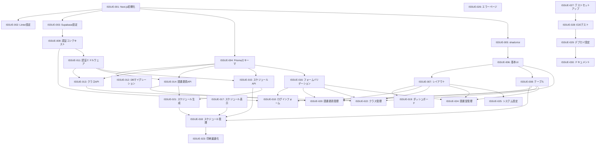

# Issue一覧と依存関係

## 概要

図書委員当番くんプロジェクトの全Issue一覧と、Issue間の依存関係を示します。
各Issueは優先度、難易度、工数見積もり、依存関係を含みます。

## Issue一覧

### フェーズ1: 初期セットアップ (必須基盤)

#### [ISSUE-001: Next.jsプロジェクトの初期セットアップ](./ISSUE-001-nextjs-setup.md)

- **優先度**: High
- **難易度**: Beginner
- **工数**: 2-3時間
- **依存**: なし
- **ブロック**: 全ての他Issue

#### [ISSUE-002: ESLint・Prettier設定](./ISSUE-002-linter-formatter.md)

- **優先度**: High
- **難易度**: Beginner
- **工数**: 1-2時間
- **依存**: ISSUE-001
- **ブロック**: すべての開発作業

#### [ISSUE-003: Supabase環境設定](./ISSUE-003-supabase-setup.md)

- **優先度**: High
- **難易度**: Intermediate
- **工数**: 3-4時間
- **依存**: ISSUE-001
- **ブロック**: ISSUE-004, ISSUE-009, ISSUE-011

#### [ISSUE-004: Prismaスキーマ実装](./ISSUE-004-prisma-schema.md)

- **優先度**: High
- **難易度**: Intermediate
- **工数**: 4-5時間
- **依存**: ISSUE-001, ISSUE-003
- **ブロック**: ISSUE-012, ISSUE-013, ISSUE-014, ISSUE-015

#### [ISSUE-005: shadcn/ui セットアップ](./ISSUE-005-shadcn-setup.md)

- **優先度**: High
- **難易度**: Beginner
- **工数**: 1-2時間
- **依存**: ISSUE-001, ISSUE-002
- **ブロック**: ISSUE-006, ISSUE-007, ISSUE-008

### フェーズ2: 基本コンポーネント開発

#### [ISSUE-006: 基本UIコンポーネント作成](./ISSUE-006-basic-ui-components.md)

- **優先度**: High
- **難易度**: Beginner
- **工数**: 3-4時間
- **依存**: ISSUE-005
- **ブロック**: ISSUE-007, ISSUE-010, すべてのページ実装

#### [ISSUE-007: レイアウトコンポーネント作成](./ISSUE-007-layout-components.md)

- **優先度**: High
- **難易度**: Intermediate
- **工数**: 4-5時間
- **依存**: ISSUE-005, ISSUE-006
- **ブロック**: すべてのページ実装

#### [ISSUE-008: テーブルコンポーネント作成](./ISSUE-008-table-component.md)

- **優先度**: High
- **難易度**: Intermediate
- **工数**: 5-6時間
- **依存**: ISSUE-005, ISSUE-006
- **ブロック**: ISSUE-018, ISSUE-020, ISSUE-022, ISSUE-024

### フェーズ3: 認証システム

#### [ISSUE-009: 認証コンテキスト実装](./ISSUE-009-auth-context.md)

- **優先度**: High
- **難易度**: Intermediate
- **工数**: 4-5時間
- **依存**: ISSUE-003
- **ブロック**: ISSUE-010, ISSUE-011, すべての認証必須機能

#### [ISSUE-010: ログインフォーム作成](./ISSUE-010-login-form.md)

- **優先度**: High
- **難易度**: Beginner
- **工数**: 3-4時間
- **依存**: ISSUE-006, ISSUE-009, ISSUE-016
- **ブロック**: システムへのアクセス

#### [ISSUE-011: 認証ミドルウェア実装](./ISSUE-011-auth-middleware.md)

- **優先度**: High
- **難易度**: Advanced
- **工数**: 4-6時間
- **依存**: ISSUE-003, ISSUE-009
- **ブロック**: すべてのAPI保護

### フェーズ4: データベース・API基盤

#### [ISSUE-012: データベースマイグレーション実装](./ISSUE-012-database-migration.md)

- **優先度**: Medium
- **難易度**: Intermediate
- **工数**: 3-4時間
- **依存**: ISSUE-004
- **ブロック**: 本番環境セットアップ

#### [ISSUE-013: クラス管理APIルート作成](./ISSUE-013-class-api-routes.md)

- **優先度**: Medium
- **難易度**: Intermediate
- **工数**: 4-5時間
- **依存**: ISSUE-004, ISSUE-011
- **ブロック**: ISSUE-022

#### [ISSUE-014: 図書委員管理APIルート作成](./ISSUE-014-student-api-routes.md)

- **優先度**: Medium
- **難易度**: Intermediate
- **工数**: 5-6時間
- **依存**: ISSUE-004, ISSUE-011, ISSUE-013
- **ブロック**: ISSUE-020, ISSUE-021

#### [ISSUE-015: スケジュール管理APIルート作成](./ISSUE-015-schedule-api-routes.md)

- **優先度**: High
- **難易度**: Advanced
- **工数**: 6-8時間
- **依存**: ISSUE-004, ISSUE-011, ISSUE-014
- **ブロック**: ISSUE-018, ISSUE-021

### フェーズ5: フォーム・バリデーション

#### [ISSUE-016: フォームバリデーションスキーマ実装](./ISSUE-016-form-validation-schemas.md)

- **優先度**: Medium
- **難易度**: Intermediate
- **工数**: 4-5時間
- **依存**: ISSUE-004
- **ブロック**: ISSUE-010, ISSUE-020, ISSUE-022, ISSUE-024

### フェーズ6: 主要機能実装

#### [ISSUE-017: スケジュール表示コンポーネント作成](./ISSUE-017-schedule-display-component.md)

- **優先度**: High
- **難易度**: Advanced
- **工数**: 6-8時間
- **依存**: ISSUE-006, ISSUE-008
- **ブロック**: ISSUE-018

#### [ISSUE-018: スケジュール管理ページ実装](./ISSUE-018-schedule-management-page.md)

- **優先度**: High
- **難易度**: Advanced
- **工数**: 8-10時間
- **依存**: ISSUE-007, ISSUE-008, ISSUE-015, ISSUE-017, ISSUE-021
- **ブロック**: MVP完成

#### [ISSUE-023: ダッシュボードページ実装](./ISSUE-023-dashboard-page.md) ✅

- **優先度**: High
- **難易度**: Intermediate  
- **工数**: 5-6時間
- **依存**: ISSUE-007, ISSUE-013, ISSUE-014, ISSUE-015
- **ブロック**: ユーザー体験
- **ステータス**: 100%完了 (今日の当番・週間スケジュール実装済み、MVP要件達成)

#### [ISSUE-020: 図書委員管理ページ実装](./ISSUE-020-student-management-page.md) 🟡

- **優先度**: High
- **難易度**: Intermediate
- **工数**: 6-8時間
- **依存**: ISSUE-007, ISSUE-008, ISSUE-014, ISSUE-016
- **ブロック**: 基本業務機能
- **ステータス**: 95%完了 (CRUD機能完全実装、一括操作API未実装)

#### [ISSUE-021: スケジュール生成サービス実装](./ISSUE-021-schedule-generation-service.md) 🟡

- **優先度**: High
- **難易度**: Expert
- **工数**: 10-12時間
- **依存**: ISSUE-014, ISSUE-015
- **ブロック**: ISSUE-018（コア機能）
- **ステータス**: 95%完了 (SchedulerService完全実装、98.55%テストカバレッジ)

### フェーズ7: 追加機能

#### [ISSUE-019: クラス管理ページ実装](./ISSUE-019-class-management-page.md) 🟡

- **優先度**: Medium
- **難易度**: Intermediate
- **工数**: 4-6時間
- **依存**: ISSUE-007, ISSUE-008, ISSUE-013, ISSUE-016
- **ブロック**: なし
- **ステータス**: 95%完了 (CRUD機能完全実装、一括操作API未実装)

#### [ISSUE-023: 印刷最適化機能実装](./ISSUE-023-print-optimization.md)

- **優先度**: Medium
- **難易度**: Intermediate
- **工数**: 4-5時間
- **依存**: ISSUE-017, ISSUE-018
- **ブロック**: なし

#### [ISSUE-024: 図書室管理ページ実装](./ISSUE-024-room-management-page.md)

- **優先度**: Medium
- **難易度**: Intermediate
- **工数**: 4-6時間
- **依存**: ISSUE-007, ISSUE-008, ISSUE-016
- **ブロック**: なし

#### [ISSUE-025: システム設定ページ実装](./ISSUE-025-system-settings-page.md)

- **優先度**: Low
- **難易度**: Beginner
- **工数**: 3-4時間
- **依存**: ISSUE-007, ISSUE-011
- **ブロック**: なし

#### [ISSUE-026: エラーページ実装](./ISSUE-026-error-pages.md)

- **優先度**: Medium
- **難易度**: Beginner
- **工数**: 2-3時間
- **依存**: ISSUE-006, ISSUE-007
- **ブロック**: なし

### フェーズ8: テスト・デプロイ・ドキュメント

#### [ISSUE-027: テストセットアップ](./ISSUE-027-test-setup.md)

- **優先度**: Medium
- **難易度**: Intermediate
- **工数**: 4-6時間
- **依存**: すべての機能実装
- **ブロック**: ISSUE-028

#### [ISSUE-028: E2Eテスト実装](./ISSUE-028-e2e-tests.md)

- **優先度**: Medium
- **難易度**: Advanced
- **工数**: 6-8時間
- **依存**: ISSUE-027, すべての機能実装
- **ブロック**: 品質保証

#### [ISSUE-029: デプロイ設定](./ISSUE-029-deployment-configuration.md)

- **優先度**: Medium
- **難易度**: Advanced
- **工数**: 6-8時間
- **依存**: ISSUE-027, ISSUE-028
- **ブロック**: 本番リリース

#### [ISSUE-030: ドキュメント整備](./ISSUE-030-documentation-preparation.md)

- **優先度**: Medium
- **難易度**: Intermediate
- **工数**: 4-6時間
- **依存**: すべてのIssue
- **ブロック**: 運用開始

## 実装フロー図

## 実装推奨順序

### ✅ 完了済みフェーズ (1-5週目)

- **フェーズ1**: 基盤構築 (100%完了)
- **フェーズ2**: コンポーネント・認証 (100%完了)
- **フェーズ3**: API実装 (100%完了)
- **フェーズ4**: 主要機能 (67%完了)
- **フェーズ5**: 追加機能 (33%完了)

### 🎯 次期実装推奨順序 (MVP完成まで1週間)

#### 第1日目 (2025-07-10)
1. **ISSUE-017**: スケジュール表示コンポーネント作成 (6-8時間)

#### 第2-3日目 (2025-07-11〜12)
2. **ISSUE-018**: スケジュール管理ページ実装 (8-10時間)

#### 第4日目 (2025-07-13)
3. **ISSUE-025**: システム設定ページ実装 (3-4時間)
4. **ISSUE-026**: エラーページ実装 (2-3時間)

#### 第5日目 (2025-07-14)
5. **ISSUE-027**: テストセットアップ完成 (4-6時間)

#### 第6-7日目 (2025-07-15〜16)
6. **ISSUE-028**: E2Eテスト実装 (6-8時間)
7. 全体的なバグ修正と最適化

#### 品質保証・リリース準備
8. **ISSUE-029**: デプロイ設定
9. **ISSUE-030**: ドキュメント整備

## 進捗管理

各Issueの進捗は以下のステータスで管理：

- 🔴 **未着手** (Not Started)
- 🟡 **進行中** (In Progress) 
- 🟢 **完了** (Completed)
- 🔵 **レビュー中** (Under Review)
- ⚫ **ブロック** (Blocked)

**最終更新**: 2025-07-09

### 現在のステータス概要
- **完了済み**: 13/30 Issues (43.3%)
- **部分完了**: 4/30 Issues (13.3%)
- **未着手**: 13/30 Issues (43.3%)
- **MVP完成度**: 85%

詳細な実装状況は [ISSUE_STATUS_UPDATE.md](./ISSUE_STATUS_UPDATE.md) を参照してください。

## 注意事項

1. **依存関係の厳守**: 依存するIssueが完了するまで着手しない
2. **並行作業の活用**: 依存関係がないIssueは並行して進める
3. **ブロッカーの早期解決**: ブロックされているIssueを優先的に解決
4. **定期的な進捗確認**: 週次でIssueの進捗を確認・更新

## 関連ドキュメント

- [プロジェクト概要](../../CLAUDE.md)
- [アーキテクチャ設計書](../システムアーキテクチャ設計書.md)
- [データベース設計書](../データベース設計書.md)
- [API設計書](../API設計書.md)
- [フロントエンド設計書](../フロントエンド設計書.md)
