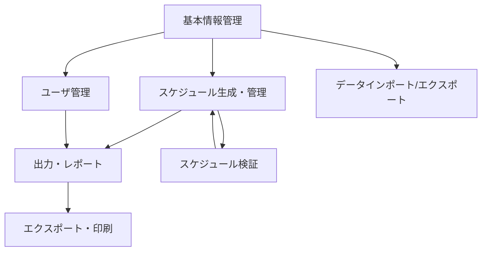

# 要件仕様書 - 図書委員当番割り当てシステム

## 1. はじめに

### 1.1 背景と目的

この文書は、小学校の図書委員（5年生・6年生）向けスケジュール管理アプリケーション開発のための機能要件を定義します。現在、図書委員の当番スケジュール作成は手動で行われており、複雑なルールの適用と公平な割り当ての確保に多大な労力を要しています。このシステムはこのプロセスを自動化し、教師の作業負荷を軽減し、効率的な図書室運営を可能にします。

### 1.2 図書委員当番ルール

システムは以下の割り当てルールを実装する必要があります：

- **対象生徒**: 5年生・6年生が図書委員として活動
- **学年構成**: 各学年は2クラス以上で構成（設定可能）
- **委員会構成**: 各クラスに2-3名の図書委員
- **図書室**: 2つの図書室に人員配置が必要
- **運営日**: 月曜日から金曜日の当番割り当て
- **スケジュール期間**: 年2回のスケジュール作成と当番ローテーション
- **ローテーションルール**: 前半で水曜・金曜に割り当てられた生徒は、後半では水曜・金曜に割り当てられない
- **週間割り当て**: 各委員は週に正確に2日の当番
- **クラス分散**: 同じクラスの委員が同じ日に割り当てられてはならない
- **学年バランス**: 各学年の委員は偏りなく各曜日に均等に分散される必要がある

## 2. システム概要

### 2.1 システムアーキテクチャ

システムは5つの主要機能グループで構成されます：

1. **基本情報管理**: 学年、クラス、委員、図書室の中核データ管理
2. **スケジュール生成・管理**: 自動スケジュール作成とルール適用
3. **ユーザ機能**: 認証、個人設定、ユーザ固有機能
4. **出力・レポート**: スケジュールとレポートの表示・エクスポート機能
5. **システム拡張**: スケーラビリティと統合のための高度機能

### 2.2 機能関係

## 3. 機能要件

### 3.1 基本情報管理機能

#### 3.1.1 学年情報管理
- **機能ID**: 1.1.1
- **説明**: 学年レベル情報の管理
- **要件**:
  - 学年情報の追加、編集、削除
  - 学年レベルの順序（5年生、6年生）
  - アクティブ/非アクティブ状態管理
- **制約**: クラスデータとの参照整合性を維持する必要がある

#### 3.1.2 クラス情報管理
- **機能ID**: 1.1.2
- **説明**: 学年内のクラス情報管理
- **要件**:
  - 学年関連付けによるクラス作成
  - クラス命名規則（例："5-A"、"6-B"）
  - 生徒定員追跡
- **制約**: 各学年は最低2クラス必要

#### 3.1.3 一括データインポート
- **機能ID**: 1.1.3
- **説明**: 学年・クラスデータの一括インポート
- **要件**:
  - CSVファイルインポート機能
  - データ検証とエラーレポート
  - テンプレートファイル生成
- **実装フェーズ**: フェーズ2

#### 3.1.4 図書委員管理
- **機能ID**: 1.2.1
- **説明**: 個別委員情報の管理
- **要件**:
  - 学年/クラス関連付けによる委員登録
  - 連絡先情報管理
  - 役割割り当て（一般委員、リーダー等）
  - 利用可能性設定
- **制約**: クラスあたり2-3名

#### 3.1.5 委員一括インポート
- **機能ID**: 1.2.2
- **説明**: 委員データの一括インポート
- **要件**:
  - 検証付きCSVインポート
  - 重複検出・処理
  - エラー修正ワークフロー
- **実装フェーズ**: フェーズ2

#### 3.1.6 委員状況管理
- **機能ID**: 1.2.3
- **説明**: 委員変更・休暇管理の処理
- **要件**:
  - 休暇追跡
  - 転校対応
  - 状況変更通知
- **実装フェーズ**: フェーズ2

#### 3.1.7 図書室管理
- **機能ID**: 1.3.1
- **説明**: 図書室情報の設定
- **要件**:
  - 図書室識別・命名
  - 定員・人員要件
  - 設備・特別要件
- **制約**: 正確に2つの図書室

#### 3.1.8 利用時間設定
- **機能ID**: 1.3.2
- **説明**: 図書室利用時間・利用可能性の設定
- **要件**:
  - 日次利用時間
  - 休日・特別イベント対応
  - 図書室別スケジューリング
- **制約**: 月曜日から金曜日の運営

### 3.2 スケジュール生成・管理機能

#### 3.2.1 基本ルール設定
- **機能ID**: 2.1.1
- **説明**: 基本的なスケジューリングルールの設定
- **要件**:
  - ルール優先度設定
  - 制約定義インターフェース
  - ルール検証・テスト
- **実装される基本ルール**:
  - 委員1人あたり週2日の当番
  - 同じクラスの委員は同じ日に配置しない
  - 学年の曜日間均等分散
  - 学期変更時のローテーションルール

#### 3.2.2 例外ルール設定
- **機能ID**: 2.1.2
- **説明**: 特別ケース・例外の処理
- **要件**:
  - 休日スケジューリングルール
  - 特別イベント対応
  - 緊急割り当てプロトコル
- **実装フェーズ**: フェーズ2

#### 3.2.3 前期スケジュール生成
- **機能ID**: 2.2.1
- **説明**: 前半年スケジュールの生成
- **要件**:
  - 自動割り当てアルゴリズム
  - 衝突検出・解決
  - プレビュー・承認ワークフロー
- **制約**: 全ての基本ルールに従う必要がある

#### 3.2.4 後期スケジュール生成
- **機能ID**: 2.2.2
- **説明**: ローテーション付き後半年スケジュール生成
- **要件**:
  - ローテーションルール適用
  - 前期との継続性
  - 公平性検証
- **制約**: 水曜・金曜ローテーションルール

#### 3.2.5 スケジューリングエンジン
- **機能ID**: 2.2.3
- **説明**: スケジュール生成の中核アルゴリズム
- **要件**:
  - 制約充足問題解決
  - 公平性の最適化
  - リアルタイム生成のパフォーマンス
- **技術要件**: 一般的な学校規模で30秒以内に処理

#### 3.2.6 手動スケジュール調整
- **機能ID**: 2.3.1
- **説明**: 生成されたスケジュールの手動修正許可
- **要件**:
  - ドラッグアンドドロップインターフェース
  - リアルタイム検証
  - 変更追跡・監査証跡
- **実装フェーズ**: フェーズ2

#### 3.2.7 当番交代管理
- **機能ID**: 2.3.2
- **説明**: 委員間の当番交代処理
- **要件**:
  - 交代申請ワークフロー
  - 承認プロセス
  - 通知システム
- **実装フェーズ**: フェーズ2

#### 3.2.8 欠席管理
- **機能ID**: 2.3.3
- **説明**: 委員欠席・代替処理
- **要件**:
  - 欠席報告インターフェース
  - 自動代替候補提案
  - 緊急割り当てプロトコル
- **実装フェーズ**: フェーズ2

#### 3.2.9 ルール適合性検証
- **機能ID**: 2.4.1
- **説明**: 全ルールへのスケジュール遵守確認
- **要件**:
  - 包括的ルールチェック
  - 違反レポート
  - 修正提案
- **パフォーマンス**: 10秒以内で検証完了

#### 3.2.10 公平性検証
- **機能ID**: 2.4.2
- **説明**: スケジュール公平性・バランス分析
- **要件**:
  - 割り当ての統計分析
  - 不均衡検出
  - 推奨エンジン
- **実装フェーズ**: フェーズ2

### 3.3 ユーザ機能

#### 3.3.1 ユーザ登録
- **機能ID**: 3.1.1
- **説明**: 新規ユーザアカウント作成
- **要件**:
  - セキュアな登録プロセス
  - メール認証
  - 役割割り当て
- **セキュリティ**: パスワード強度要件

#### 3.3.2 認証システム
- **機能ID**: 3.1.2
- **説明**: ユーザログイン・セッション管理
- **要件**:
  - セキュアなログインプロセス
  - セッションタイムアウト処理
  - 多要素認証サポート
- **セキュリティ**: 業界標準認証

#### 3.3.3 権限管理
- **機能ID**: 3.1.3
- **説明**: ロールベースアクセス制御
- **要件**:
  - ユーザ役割定義
  - 権限マトリックス
  - アクセスレベル適用
- **役割**: 管理者、教師、委員、閲覧者

#### 3.3.4 個人スケジュール表示
- **機能ID**: 3.2.1
- **説明**: 個人委員スケジュール表示
- **要件**:
  - 個人当番カレンダー
  - 今後の割り当て
  - 過去の当番記録
- **アクセシビリティ**: モバイル対応インターフェース

#### 3.3.5 当番交代申請
- **機能ID**: 3.2.2
- **説明**: 委員主導の当番交代
- **要件**:
  - 交代申請インターフェース
  - 同級生承認ワークフロー
  - 監督者通知
- **実装フェーズ**: フェーズ2

#### 3.3.6 リマインダー通知
- **機能ID**: 3.3.1
- **説明**: 自動当番リマインダー
- **要件**:
  - 設定可能なリマインダータイミング
  - 複数通知チャンネル
  - 個人設定オプション
- **実装フェーズ**: フェーズ3

#### 3.3.7 スケジュール変更通知
- **機能ID**: 3.3.2
- **説明**: スケジュール修正のアラート
- **要件**:
  - リアルタイム通知
  - 変更概要表示
  - 確認追跡
- **実装フェーズ**: フェーズ2

### 3.4 出力・レポート機能

#### 3.4.1 月間カレンダー表示
- **機能ID**: 4.1.1
- **説明**: 月全体のスケジュール表示
- **要件**:
  - カレンダーグリッドレイアウト
  - 日次割り当て表示
  - 図書室/学年別色分け
- **エクスポート**: PDFと印刷サポート

#### 3.4.2 週間スケジュール表示
- **機能ID**: 4.1.2
- **説明**: 週集中スケジュール表示
- **要件**:
  - 詳細週間レイアウト
  - 委員連絡先情報
  - クイック編集機能
- **レスポンシブ**: モバイル・タブレットサポート

#### 3.4.3 クラス別表示
- **機能ID**: 4.1.3
- **説明**: クラスフィルタースケジュール表示
- **要件**:
  - クラス選択インターフェース
  - フィルター割り当て表示
  - クラス概要統計
- **実装フェーズ**: フェーズ2

#### 3.4.4 当番実績レポート
- **機能ID**: 4.2.1
- **説明**: 個人・クラス実績追跡
- **要件**:
  - 割り当て完了追跡
  - パフォーマンスメトリクス
  - 比較分析
- **実装フェーズ**: フェーズ2

#### 3.4.5 公平性分析レポート
- **機能ID**: 4.2.2
- **説明**: システム全体の公平性分析
- **要件**:
  - 統計分布分析
  - 偏り検出
  - 改善推奨
- **実装フェーズ**: フェーズ3

#### 3.4.6 スケジュールエクスポート
- **機能ID**: 4.3.1
- **説明**: データエクスポート機能
- **要件**:
  - 複数フォーマットサポート（PDF、Excel、CSV）
  - カスタム日付範囲選択
  - テンプレートカスタマイゼーション
- **実装フェーズ**: フェーズ2

#### 3.4.7 印刷最適化フォーマット
- **機能ID**: 4.3.2
- **説明**: 印刷対応スケジュールレイアウト
- **要件**:
  - プロフェッショナルフォーマット
  - ページブレーク最適化
  - ヘッダー/フッターカスタマイゼーション
- **実装フェーズ**: フェーズ2

### 3.5 システム拡張機能

#### 3.5.1 委員会テンプレート
- **機能ID**: 5.1.1
- **説明**: 再利用可能な設定テンプレート
- **要件**:
  - テンプレート作成・管理
  - 新規学校向けクイックセットアップ
  - テンプレート共有機能
- **実装フェーズ**: フェーズ3

#### 3.5.2 委員会カスタマイゼーション
- **機能ID**: 5.1.2
- **説明**: 学校固有のカスタマイゼーション
- **要件**:
  - 設定可能なビジネスルール
  - カスタムフィールド定義
  - ブランディングカスタマイゼーション
- **実装フェーズ**: フェーズ3

#### 3.5.3 学校カレンダー統合
- **機能ID**: 5.2.1
- **説明**: 学校カレンダーシステムとの統合
- **要件**:
  - カレンダーAPI統合
  - 休日同期
  - イベントベーススケジューリング
- **実装フェーズ**: フェーズ3

#### 3.5.4 掲示板統合
- **機能ID**: 5.2.2
- **説明**: 学校コミュニケーションシステムとの統合
- **要件**:
  - お知らせ投稿
  - メッセージ配信
  - コミュニケーション追跡
- **実装フェーズ**: フェーズ3

## 4. 非機能要件

### 4.1 パフォーマンス要件

- **応答時間**: 通常条件下でWebページは3秒以内に読み込み完了
- **処理時間**: 一般的な学校規模（委員200名）でスケジュール生成は30秒以内に完了
- **同時ユーザ**: 最低50名の同時ユーザをサポート
- **可用性**: 学校時間帯（平日午前8時-午後6時）における99.5%のアップタイム

### 4.2 セキュリティ要件

- **認証**: パスワードポリシー付き業界標準ユーザ認証
- **認可**: 最小権限原則によるロールベースアクセス制御
- **データ保護**: 転送時・保存時の機密データ暗号化
- **監査証跡**: 全システム変更の包括的ログ記録

### 4.3 ユーザビリティ要件

- **ユーザインターフェース**: 最小限のトレーニングで使用可能な直感的設計
- **アクセシビリティ**: WCAG 2.1 AA準拠のアクセシビリティ対応
- **モバイルサポート**: タブレット・スマートフォン対応レスポンシブ設計
- **ブラウザサポート**: モダンブラウザ対応（Chrome、Firefox、Safari、Edge）

### 4.4 スケーラビリティ要件

- **ユーザ増加**: 500名以上のユーザをサポートするスケール対応
- **データ増加**: 10年以上の過去スケジュールデータ処理
- **機能拡張**: 将来の機能強化をサポートするモジュラーアーキテクチャ
- **複数学校**: 複数学校展開をサポートするアーキテクチャ

### 4.5 信頼性要件

- **データ整合性**: 適切なバックアップ・復旧手順によるゼロデータ損失
- **エラーハンドリング**: ユーザフレンドリーなメッセージによる適切なエラー処理
- **バックアップ**: ポイントインタイム復旧付き日次自動バックアップ
- **災害復旧**: 24時間RTO目標の復旧手順

## 5. 技術的制約

### 5.1 技術制約

- **フロントエンド**: React/Next.jsを使用したモダンWebアプリケーション
- **バックエンド**: APIファーストアーキテクチャのクラウドベースソリューション
- **データベース**: PostgreSQLまたは互換性のあるリレーショナルデータベース
- **ホスティング**: オートスケーリング対応クラウドプラットフォーム

### 5.2 統合制約

- **データインポート**: 一括データ入力用CSVファイルインポートサポート
- **エクスポートフォーマット**: PDF、Excel、CSVエクスポート機能
- **API標準**: OpenAPI仕様に従ったRESTful API設計
- **認証**: シングルサインオン（SSO）統合サポート

### 5.3 コンプライアンス要件

- **データプライバシー**: 地域プライバシー規制への準拠
- **教育標準**: 教育技術標準への準拠
- **セキュリティ標準**: 業界セキュリティベストプラクティスの実装
- **アクセシビリティ**: アクセシビリティガイドラインへの準拠

## 6. ユーザストーリー

### 6.1 教師/管理者ストーリー

1. **教師として**、公平な当番スケジュールを自動生成したいので、時間を節約し公平な割り当てを確保できる。

2. **管理者として**、学校固有のルールを設定したいので、システムが独自の要件に合致する。

3. **教師として**、生成されたスケジュールを簡単に修正したいので、特別な事情や要求に対応できる。

4. **管理者として**、生徒データを一括インポートしたいので、毎年システムを迅速にセットアップできる。

5. **教師として**、印刷可能なスケジュールを生成したいので、教室や図書室に掲示できる。

### 6.2 委員ストーリー

1. **委員として**、個人の当番スケジュールを表示したいので、いつ働くかを知ることができる。

2. **委員として**、クラスメートと当番交代を申請したいので、スケジュール衝突を処理できる。

3. **委員として**、今後の当番についてリマインダーを受け取りたいので、責任を忘れない。

4. **委員として**、図書室の全体スケジュールを表示したいので、友達がいつ働いているかを確認できる。

### 6.3 システム管理者ストーリー

1. **システム管理者として**、包括的な監査ログが欲しいので、全システム変更を追跡しセキュリティを維持できる。

2. **システム管理者として**、自動バックアップ手順が欲しいので、データが保護され復旧可能である。

3. **システム管理者として**、パフォーマンス監視が欲しいので、システムが応答時間要件を満たすことを確認できる。

4. **システム管理者として**、ロールベース権限が欲しいので、ユーザが適切な機能のみにアクセスする。

## 7. 受け入れ基準

### 7.1 スケジュール生成基準

- 生成されたスケジュールは設定された全ルールに100%準拠する必要がある
- 委員は週に2日を超える当番日を持ってはならない
- 学年分散の分散は平日間で10%を超えてはならない
- ローテーションルールは学期境界で適用される必要がある

### 7.2 ユーザインターフェース基準

- 全主要機能はメインダッシュボードから3クリック以内でアクセス可能
- モバイルインターフェースは5インチ画面でスケジュールを明確に表示する必要がある
- 印刷レイアウトはコンテンツカットオフなしで標準用紙サイズに適合する必要がある
- エラーメッセージは解決のための明確なガイダンスを提供する必要がある

### 7.3 パフォーマンス基準

- 委員200名のスケジュール生成は30秒以内に完了
- 一般的なコンテンツのWebページ読み込み時間は3秒以内
- システムはパフォーマンス低下なしに50名の同時ユーザをサポート
- 通常の操作でデータベースクエリは2秒以内に実行

### 7.4 データ整合性基準

- 通常の操作・システム更新時にゼロデータ損失
- 検証時に全ルール違反が検出・レポートされる
- 監査証跡が全重要システム変更をキャプチャ
- バックアップ・復旧手順が月次で検証される

## 8. 実装優先度

### 8.1 高優先度（フェーズ1）
- 基本情報管理
- 中核スケジュール生成エンジン
- ルール適合性検証
- 基本レポート・表示

### 8.2 中優先度（フェーズ2）
- 高度なスケジュール管理
- 一括インポート/エクスポート機能
- ユーザ通知システム
- 強化されたレポート機能

### 8.3 低優先度（フェーズ3）
- システム統合機能
- 高度な分析・レポート
- テンプレート・カスタマイゼーション機能
- 複数学校サポート機能
