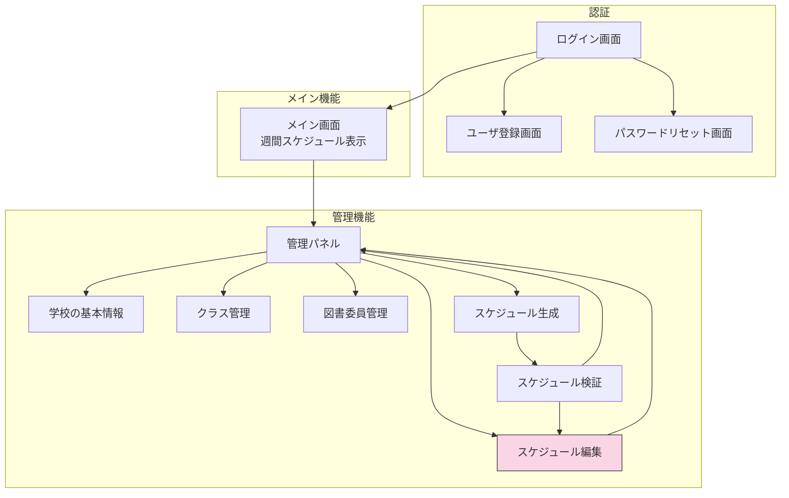

# 画面設計仕様書 - 図書委員当番割り当てシステム（フェーズ1）

この設計書は図書委員当番割り当てシステムのフェーズ1開発における画面設計を記載しています。フェーズ1では、基本的なユーザ認証、学校情報管理、図書委員管理、スケジュール生成・編集機能を実装します。一部の機能（エクスポートなど）はフェーズ2以降の実装予定です。

## 1. 画面構成概要

システムは以下の画面構成で構成されます：

```markdown
トップページ
├── 認証
│   ├── ログイン画面
│   ├── ユーザ登録画面
│   └── パスワードリセット画面
├── メイン画面（週間スケジュール表示）
└── 管理パネル
    ├── 基本情報管理
    │   ├── 学校の基本情報（図書室管理・クラス管理を含む）
    │   └── 図書委員管理
    └── スケジュール管理
        ├── スケジュール生成（検証を含む）
        └── スケジュール編集
```

### 1.1 画面遷移図

以下はシステム内の主要な画面遷移を表したフローチャートです：




## 2. 共通UI要素

### 2.1 ヘッダー

全画面共通のヘッダー要素：

- システムロゴ（左上）：本のアイコンとシステム名
- 現在のページタイトル（中央）
- ユーザメニュー（右上）
  - ログイン中のユーザ名
  - 管理パネルアクセス用の歯車アイコン
  - ログアウトボタン

### 2.2 ナビゲーション

以下の項目を含む簡潔なナビゲーションメニュー：

- メイン画面
- 管理パネル（管理者のみ表示）

### 2.3 デザインシステム

- カラースキーム：親しみやすい外観のための明るいパステルカラー
- タイポグラフィ：明確なフォントによる読みやすさ重視
- レイアウト：様々な画面サイズに対応するレスポンシブ設計
- アイコン：システム全体で一貫したアイコン体系
- 背景：情報表示のための白い半透明背景

### 2.4 操作フィードバック

#### 2.4.1 確認ダイアログ

- **対象操作**：登録、更新、削除など、データに変更を加える全ての操作
- **表示タイミング**：対応するボタン（保存、登録、削除など）押下時
- **表示方法**：モーダルダイアログ（背景をオーバーレイで暗くし、ダイアログにフォーカス）
- **デザイン**：
  - タイトル：操作内容を明示（例：「データを保存します」「削除の確認」）
  - アイコン：操作タイプに応じたアイコン表示（保存はディスクアイコン、削除は警告アイコンなど）
  - メッセージ：実行される操作の内容と影響を簡潔に説明
  - ボタン：「キャンセル」と「確定」の2つのボタンを配置（危険な操作の場合は確定ボタンを目立つ色で表示）

#### 2.4.2 操作結果通知

- **成功通知**：
  - 表示方法：モーダルダイアログ
  - デザイン：
    - タイトル：「成功」または具体的な成功内容
    - アイコン：チェックマークや成功を示す緑色のアイコン
    - メッセージ：実行された操作の内容と結果を簡潔に説明
    - ボタン：「OK」または「閉じる」ボタン
  - 自動消去：ユーザーが確認後、または数秒後に自動的に消去

- **失敗通知**：
  - 表示方法：モーダルダイアログ
  - デザイン：
    - タイトル：「エラー」または具体的なエラー内容
    - アイコン：警告や失敗を示す赤色のアイコン
    - メッセージ：エラーの内容と可能な対処方法を説明
    - ボタン：「OK」または「閉じる」ボタン
  - 自動消去：ユーザーが確認するまで表示を維持

#### 2.4.3 ボタンデザインと状態

- **主要アクション（保存、登録）ボタン**：
  - 通常状態：青緑系の目立つ色、丸みを帯びた形状
  - ホバー状態：若干暗い色調に変化
  - 押下状態：さらに暗い色調に変化
  - 無効状態：グレーアウト表示

- **危険アクション（削除）ボタン**：
  - 通常状態：ピンク/赤系の警告色、丸みを帯びた形状
  - ホバー状態：若干暗い色調に変化
  - 押下状態：さらに暗い色調に変化
  - 無効状態：グレーアウト表示

- **キャンセルボタン**：
  - 通常状態：グレー系の控えめな色、丸みを帯びた形状
  - ホバー状態：若干暗い色調に変化
  - 押下状態：さらに暗い色調に変化

## 3. メイン画面の週間スケジュール表示機能（閲覧専用）

### 3.1 画面概要

ユーザがログイン後に最初に見る主要画面で、当日の当番割り当てと週間スケジュールを同時に表示します。閲覧機能のみでスケジュールの編集は管理パネルから行います。

### 3.2 レイアウト構成

- ヘッダーセクション：学校名、ログインユーザ情報、管理パネルへのリンク
- メインセクション：
  - 左側：今日の当番割り当て
  - 右側：週間スケジュール（月曜日-金曜日）
- フッターセクション：アプリケーション名

### 3.3 表示要素

#### 3.3.1 今日の当番情報

- 日付：曜日表示
- 担当委員付きの図書室割り当て
- 割り当てが存在しない場合のアラートメッセージ
- アイコンと名前による委員表示

#### 3.3.2 週間スケジュール

- 日別表示（特定の日付なし）
- 各日の図書室割り当て
- 委員アイコンと名前
- 未割り当てスロットの視覚的インジケーター
  - 破線ボーダー：未割り当てのスロットは点線で囲まれ、明確に識別できます
  - 軽い警告色（淡いオレンジ色）の背景：未割り当てスロットには配色で視覚的な注意を促します
  - 「未割り当て」テキストラベル：明示的に状態を表示します
  - 追加アクション用のプラスアイコン：管理者が簡単に委員を割り当てられるよう誘導します

### 3.4 警告メッセージ

- 学校情報が登録されていない場合、学校情報を登録する警告を表示
- 現在日時のスケジュールが登録されていない場合、スケジュールを登録する警告を表示

### 3.5 ユーザインタラクション

- 委員名ホバーで詳細情報表示
- インタラクティブ要素のホバーエフェクト
- 管理者向けの管理パネルへのリンク

### 3.6 画面遷移

- 管理ボタン → 管理パネル

## 4. 認証画面

### 4.1 ログイン画面

#### 4.1.1 レイアウト
- 中央配置のログインフォーム
- 上部に学校ロゴ
- ユーザ名/パスワードフィールド
- ログインボタン
- 登録・パスワードリセットへのリンク

#### 4.1.2 フォームフィールド
- ユーザ名（必須）
- パスワード（必須、マスク入力）
- ログイン状態を保持するチェックボックス
- バリデーションメッセージ

#### 4.1.3 エラーハンドリング
- 無効な認証情報メッセージ
- フィールドバリデーションエラー
- 接続タイムアウトメッセージ

### 4.2 ユーザ登録画面

#### 4.2.1 フォームフィールド
- ユーザ名（一意性検証）
- メールアドレス
- パスワード（強度要件）
- パスワード確認
- 学年・クラス選択
- 役割割り当て（該当する場合）

#### 4.2.2 バリデーションルール
- ユーザ名可用性チェック
- メール形式検証
- パスワード強度要件
- パスワード確認の一致

### 4.3 パスワードリセット画面

#### 4.3.1 プロセスフロー
- リセット要求のメール入力
- 確認メッセージ
- リセットリンク付きメール
- 新パスワード入力フォーム

## 5. 管理パネル

### 5.1 メイン管理ダッシュボード

#### 5.1.1 レイアウト
- 管理パネルタイトル付きヘッダー
- メインダッシュボードへの戻りリンク
- 管理メニューグリッド

#### 5.1.2 管理セクション

- **基本情報管理**
  - 学校の基本情報（図書室管理・クラス管理を含む）
  - 図書委員管理

- **スケジュール管理**
  - スケジュール生成（検証を含む）
  - スケジュール編集

### 5.2 学校の基本情報画面（図書室管理・クラス管理を含む）

#### 5.2.1 機能

- 学校情報の追加/編集
- 役職情報の追加/編集/削除
- 学期日程管理
- 図書室情報の管理
- クラス作成・管理

#### 5.2.2 フォームフィールド

- 学校情報セクション
  - 学校名
  - 前期開始日・終了日
  - 後期開始日・終了日
  - アクティブ状態
- 役職情報セクション
  - 役職名（例："委員長"、"副委員長"、"書記"）
  - 役職の説明
  - 順序
- 図書室情報セクション
  - 図書室名/識別子
  - 図書室定員
  - 必要スタッフ数
  - 特別設備・要件
  - 運営スケジュール
- クラス情報セクション
  - クラス名（例："1-A"、"2-B"）
  - 関連学年選択
  - 最大生徒定員
  - 現在の生徒数

### 5.3 図書委員管理画面

#### 5.3.1 機能

- 委員登録・編集
- 役割割り当て
- 利用可能性設定
- 一括インポート機能

#### 5.3.2 フォームフィールド

- 生徒名
- 学年・クラス選択
- 連絡先情報
- 役割（一般委員、リーダー等）
- 利用可能性設定
- 特記事項

### 5.4 スケジュール生成画面

#### 5.4.1 機能

- 自動スケジュール作成
- 衝突解決
- プレビュー・承認

#### 5.4.2 生成プロセス

- 当番ルールの適用：各委員の利用可能性や役職を考慮し、アルゴリズムによって配置
- 制約条件の適用：過去の実績や委員の負担バランスを考慮した配置調整
- 公平性検証：全委員に対する割り当て量のバランスチェック
- 一貫性確保：各図書室での安定した運営のための同一役職配置
- スケジュールプレビュー
- 最終承認・保存

### 5.5 スケジュール検証画面（スケジュール生成の一部として表示）

#### 5.5.1 機能

- ルール適合性チェック
- 衝突識別
- 修正提案
- 検証レポート

#### 5.5.2 検証結果

- ルール違反リスト
- 委員作業負荷分析
- カバレッジギャップ識別
- 推奨修正
- アクションオプション：
  - スケジュール編集画面への遷移
  - 管理パネルへの戻り

### 5.6 スケジュール編集画面

#### 5.6.1 機能概要

- スケジュールの詳細編集が可能な画面
- マスタースケジュールの作成と全体管理が目的
- 週間の定期スケジュールを設定・編集

#### 5.6.2 レイアウト

- 曜日別カレンダーグリッド表示（月曜日から金曜日）
- 委員リストパネル
- 編集ツール・コントロール
- 保存/キャンセルオプション
- 管理パネルへの戻るボタン

#### 5.6.3 主要機能

- 全ての曜日および図書室の割り当て編集
- 委員の一括割り当て/削除
- 割り当てルールの設定と上書き
- 複数の図書室間での調整
- 全委員の割り当て状況の確認と調整
- スケジュールのロック/アンロック
- 役職を考慮した適正配置支援
- スケジュールの複製と再利用
- 特定の曜日パターンの一括設定

#### 5.6.4 編集操作

- 割り当て追加/削除
- 委員割り当て交換
- 曜日間での割り当てコピー
- 変更履歴の確認
- ドラッグアンドドロップによる直感的操作
- 元に戻す/やり直し機能
- 管理パネルに戻る操作

<!-- メイン画面の週間スケジュール表示機能は3章に移動済み -->

## 6. レスポンシブ設計考慮事項

### 6.1 モバイル対応

- タッチフレンドリーインターフェース
- 小画面向け簡略ナビゲーション
- 重要情報の優先表示
- ナビゲーション用スワイプジェスチャー

### 6.2 タブレット最適化
- タブレット画面向け最適化レイアウト
- 強化されたタッチインタラクション
- サイドパネルナビゲーション
- 適切な場所でのマルチカラムレイアウト

### 6.3 デスクトップ機能

- 全機能セットの利用可能性
- キーボードショートカット
- マルチウィンドウサポート
- 高度な編集機能

## 7. アクセシビリティ機能

### 7.1 スクリーンリーダーサポート

- 適切な見出し構造
- 画像の代替テキスト
- フォームラベル関連付け
- キーボードナビゲーションサポート

### 7.2 視覚的アクセシビリティ
- ハイコントラストモードサポート
- スケーラブルフォントサイズ
- 色覚障害対応設計
- フォーカスインジケーター

### 7.3 運動機能アクセシビリティ

- 大きなクリック可能エリア
- キーボードのみのナビゲーション
- 音声コマンドサポート
- カスタマイズ可能なインターフェースタイミング

## 8. パフォーマンス考慮事項

### 8.1 読み込み最適化

- コンテンツの段階的読み込み
- 大規模データセットの遅延読み込み
- 最適化された画像配信
- キャッシュ戦略

### 8.2 ユーザエクスペリエンス

- スムーズなトランジション・アニメーション
- ユーザアクションに対する即座のフィードバック
- エラー防止・復旧
- 可能な限りのオフライン機能
