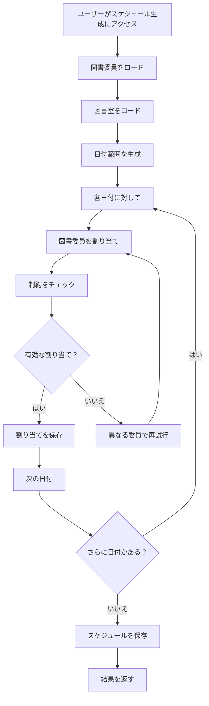
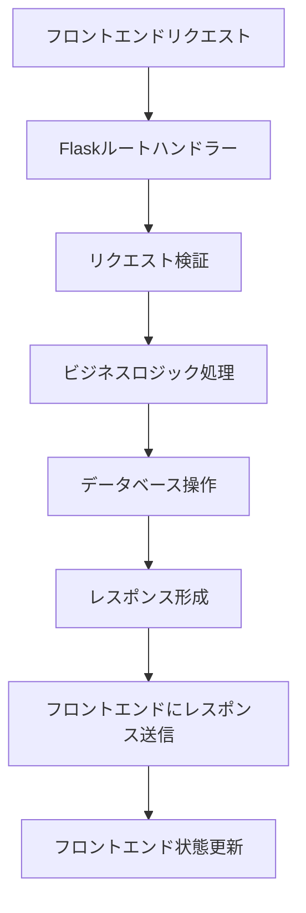

# 図書委員当番割り当てシステム - システム設計書

## 1. 概要

本文書は、図書委員当番割り当てシステム（Library Assignment System）フェーズ1のシステム設計について記述します。システムの主要コンポーネント、処理フロー、インタフェース定義の詳細情報を提供します。

## 2. システムアーキテクチャ

### 2.1 全体構成

本システムは3層アーキテクチャで構成されています：

- **プレゼンテーション層**: Next.js + React + TypeScriptを使用したSPA
- **アプリケーション層**: Python Flaskを使用したモックバックエンド
- **データアクセス層**: SQLiteデータベース

### 2.2 コンポーネント構成

```
+-------------------------+       +------------------------+        +-----------------------+
| プレゼンテーション層    |       | アプリケーション層     |        | データアクセス層      |
|                         |       |                        |        |                       |
| +---------------------+ |       | +--------------------+ |        | +-------------------+ |
| | Reactコンポーネント | | <---> | | Flask APIルート    | | <---> | | SQLiteデータベース | |
| | - ダッシュボード    | |       | | - CRUD操作         | |        | | - テーブル        | |
| | - 管理画面          | |       | | - スケジュールエンジン | |        | | - インデックス    | |
| | - 認証              | |       | | - ビジネスロジック | |        | | - 制約            | |
| +---------------------+ |       | +--------------------+ |        | +-------------------+ |
|                         |       |                        |        |                       |
| +---------------------+ |       | +--------------------+ |        |                       |
| | 状態管理            | |       | | データ検証         | |        |                       |
| | - Context API       | |       | | - エラーハンドリング | |        |                       |
| | - ローカルストレージ | |       | | - セキュリティ     | |        |                       |
| +---------------------+ |       | +--------------------+ |        |                       |
+-------------------------+       +------------------------+        +-----------------------+
```

## 3. プロジェクト構成

### 3.1 ディレクトリ構成

```
/frontend
  /src
    /app                  # Next.js App Router
      /dashboard          # ダッシュボード画面
      /management         # 管理画面（タブ切り替え式）
        /committee-members # 図書委員管理
        /generate-schedule # スケジュール生成
        /validate-schedule # スケジュール検証
      /school             # 学校基本情報管理（図書室・クラス管理統合）
    /components           # 共通コンポーネント
    /contexts             # コンテキストプロバイダー
    /lib                  # ユーティリティライブラリ
    /services             # APIサービス

/mock_backend
  app.py                  # Flaskアプリケーション
  schedule_generator.py   # スケジュール生成エンジン
  init_database.py        # データベース初期化
  /tests                  # ユニット・統合テスト
```

## 4. コアコンポーネント

### 4.1 スケジュール生成エンジン

**場所**: `mock_backend/schedule_generator.py`

**メインクラス**: `ScheduleGeneratorClass`

**主要メソッド**:
- `__init__(academic_year, is_first_half)`: 学年度と学期でジェネレーターを初期化
- `load_committee_members()`: データベースから図書委員をロード
- `load_library_rooms()`: 図書室データをロード
- `generate_schedule()`: ビジネスルールに基づいて割り当てスケジュールを生成
- `save_assignments()`: 生成された割り当てをデータベースに保存

**ビジネスルール**:
- 月曜、火曜、木曜：図書室ごとに1人
- 水曜、金曜：図書室ごとに2人
- 同日での重複割り当て禁止
- 委員間での割り当ての公平な分散

### 4.2 APIエンドポイント

#### 4.2.1 クラス管理

- `GET /api/classes`: クラス一覧取得
- `POST /api/classes`: 新しいクラスの作成
- `PUT /api/classes/:id`: クラス更新
- `DELETE /api/classes/:id`: クラス削除

#### 4.2.2 図書委員管理

- `GET /api/committee-members`: 図書委員一覧取得
- `POST /api/committee-members`: 新しい図書委員の作成
- `PUT /api/committee-members/:id`: 図書委員更新
- `DELETE /api/committee-members/:id`: 図書委員削除

#### 4.2.3 図書室管理

- `GET /api/libraries`: 図書室一覧取得
- `POST /api/libraries`: 新しい図書室の作成
- `PUT /api/libraries/:id`: 図書室更新
- `DELETE /api/libraries/:id`: 図書室削除

#### 4.2.4 スケジュール管理

- `GET /api/schedules`: スケジュール一覧取得
- `POST /api/schedules`: 新しいスケジュールの生成
- `GET /api/schedules/:id`: スケジュール詳細取得
- `DELETE /api/schedules/:id`: スケジュール削除

**APIフィールドマッピング**：
- データベースとAPIレスポンス間で以下のフィールド名変換を実施：
  - `academic_year` (DB) ↔ `academicYear` (API)
  - `is_first_half` (DB) ↔ `period` (API) ※ period: 1=前期, 2=後期
  - `schedule_name` (DB) ↔ `name` または `scheduleName` (API)
- これによりフロントエンドのキャメルケースとバックエンドのスネークケースの差異を吸収

#### 4.2.5 スケジュール割り当て管理

- `GET /api/schedule-assignments`: 割り当て一覧取得
- `POST /api/schedule-assignments`: 割り当て作成
- `PUT /api/schedule-assignments/:id`: 割り当て更新
- `DELETE /api/schedule-assignments/:id`: 割り当て削除

### 4.3 フロントエンドコンポーネント

#### 4.3.1 ダッシュボードコンポーネント

- **WeeklyScheduleView**: 週間割り当てスケジュールの表示
- **TodayAssignments**: 当日の割り当て表示
- **NavigationHeader**: メインナビゲーションコンポーネント

#### 4.3.2 管理コンポーネント

- **ClassManager**: クラスのCRUD操作
- **CommitteeMemberManager**: 図書委員のCRUD操作
- **LibraryRoomManager**: 図書室のCRUD操作
- **ScheduleGenerator**: スケジュール生成インタフェース

## 5. データフロー

### 5.1 スケジュール生成フロー



### 5.2 APIリクエストフロー



## 6. セキュリティ考慮事項

### 6.1 データ検証

- 全ユーザー入力の入力サニタイゼーション
- APIパラメーターの型チェック
- パラメーター化クエリによるSQLインジェクション防止

### 6.2 エラーハンドリング

- 包括的なエラーログ記録
- ユーザーフレンドリーなエラーメッセージ
- サービス障害時の優雅な劣化

## 7. パフォーマンス考慮事項

### 7.1 データベース最適化

- 頻繁に照会されるカラムの適切なインデックス設定
- スケジュール生成のクエリ最適化
- データベースアクセスのコネクションプール

### 7.2 フロントエンド最適化

- コンポーネントの遅延ロード
- 状態管理の最適化
- APIレスポンスのキャッシュ

## 8. 環境設定

### 8.1 環境変数

#### フロントエンド環境変数
- `NEXT_PUBLIC_API_BASE_URL`: APIサーバーのベースURL（デフォルト: `http://localhost:5200/api`）
- `PORT`: フロントエンドサーバーのポート番号（デフォルト: 3200）

#### バックエンド環境変数
- `FLASK_RUN_PORT` または `FLASK_PORT`: バックエンドサーバーのポート番号（デフォルト: 5200）

### 8.2 開発環境の起動

開発環境は専用スクリプトで簡単に起動できます：

```bash
# 開発環境の起動（フロントエンド + バックエンド）
./scripts/dev.sh

# テスト環境の起動（Issue番号ベースのポート割り当て）
./scripts/test-env.sh 15 start  # Issue #15用の環境を起動
```

### 8.3 マルチ環境対応

複数のIssueを並行してテストする場合、Issue番号をベースにしたポート番号が自動的に割り当てられます：
- フロントエンド: 3000 + Issue番号
- バックエンド: 5000 + Issue番号

## 9. テスト戦略

### 9.1 ユニットテスト

- pytestを使用したモックバックエンドAPIテスト
- Reactコンポーネントのコンポーネントテスト
- スケジュール生成のビジネスロジックテスト

### 9.2 統合テスト

- エンドツーエンドAPIテスト
- データベース統合テスト
- 完全なスケジュール生成ワークフローテスト

### 9.3 E2Eテスト

- Playwrightを使用したユーザーワークフローテスト
- クロスブラウザ互換性テスト
- 負荷下でのパフォーマンステスト

## 10. デプロイメントアーキテクチャ

### 10.1 開発環境

- フロントエンド: <http://localhost:3200>
- バックエンド: <http://localhost:5200>
- データベース: SQLiteローカルファイル

### 10.2 本番環境考慮事項

- Dockerを使用したコンテナ化
- 環境固有の設定
- データベースマイグレーション戦略
- 監視・ログ設定

## 関連文書

- [データベース設計書](./database_design.md)
- [画面設計書](./screen_design.md)
- [実装計画書](./implementation_plan.md)
- [テスト仕様書](./test_strategy.md)

---

**文書作成日**: 2025年5月25日  
**最終更新日**: 2025年5月25日  
**作成者**: 開発チーム
