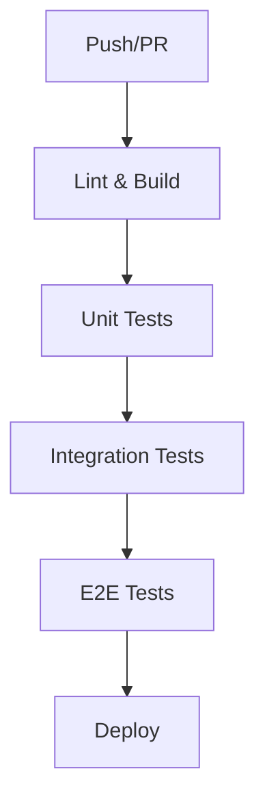

# 図書館当番割り当てシステム テスト戦略書

## 概要

本ドキュメントは図書館当番割り当てシステム全体のテスト戦略と各テストレイヤーの役割を定義します。

## テスト戦略

### テストピラミッド

```
    E2E Tests (少数)
   ┌─────────────────┐
   │    UI Tests     │  - ユーザーシナリオ
   │                 │  - ブラウザ自動化
   └─────────────────┘
        
      Integration Tests (中程度)
    ┌─────────────────────┐
    │   API Tests         │  - エンドポイント連携
    │   Database Tests    │  - データ整合性
    └─────────────────────┘
    
        Unit Tests (多数)
      ┌──────────────────────┐
      │  Component Tests      │  - 個別機能
      │  Function Tests       │  - ビジネスロジック
      │  Class Tests          │  - オブジェクト動作
      └──────────────────────┘
```

## テストレイヤー詳細

### 1. 単体テスト (Unit Tests)

**対象**: `mock_backend/tests/`

- **ファイル構成**:
  - `test_schedule_generator_fixed_class.py` - スケジュール生成ロジック
  - `test_suite.py` - 統合テストスイート
  - `test_integrated_schedule_generator.py` - 統合テスト

- **実行方法**:
```bash
cd mock_backend
pytest --cov=. --cov-report=html --cov-report=xml
```

- **カバレッジ目標**: 80%以上
- **実行頻度**: コミット毎

### 2. 統合テスト (Integration Tests)

**対象**: Mock Backend全体のAPI連携テスト

- **テスト内容**:
  - データベース連携テスト
  - API エンドポイント結合テスト
  - スケジュール生成フロー全体テスト

- **実行環境**: テスト専用データベース使用
- **実行頻度**: Pull Request作成時

### 3. End-to-End テスト (E2E Tests)

**対象**: `e2e/specs/`

- **ファイル構成**:
  - `ui-changes.spec.js` - UI変更確認テスト
  - `schedule-generation.spec.js` - スケジュール生成機能テスト
  - `weekly-schedule.spec.js` - 週間スケジュール表示テスト

- **実行方法**:
```bash
npx playwright test
```

- **実行頻度**: リリース前、主要機能変更時

## CI/CD パイプライン

### GitHub Actions ワークフロー

1. **Mock Backend Tests** (`.github/workflows/mock-backend-tests.yml`)
   - Python単体・統合テスト実行
   - コードカバレッジレポート生成
   - Pytest結果のJUnit XML出力

2. **E2E Tests** (`.github/workflows/e2e-tests.yml`)
   - Playwright自動化テスト実行
   - 複数ブラウザでの並列実行
   - 失敗時のスクリーンショット保存

### 実行順序



## テスト環境

### 開発環境
- **フロントエンド**: http://localhost:3000
- **バックエンド**: http://localhost:3001
- **データベース**: SQLite (database.db)

### CI/CD環境
- **OS**: Ubuntu Latest
- **Node.js**: 18.x
- **Python**: 3.11
- **ブラウザ**: Chromium, Firefox, WebKit

## テストデータ管理

### Mock Backend
- **データセットアップ**: `conftest.py`
- **テストフィクスチャ**: クラス、図書委員、図書室データ
- **データベース初期化**: 各テスト実行前

### E2E Tests
- **テストデータ**: `e2e/fixtures/test-data.js`
- **グローバルセットアップ**: `e2e/helpers/global-setup.js`
- **データベースリセット**: テストスイート実行前

## 品質メトリクス

### コードカバレッジ
- **目標**: 単体テスト 80%以上
- **レポート**: HTMLカバレッジレポート生成
- **除外対象**: テストファイル、設定ファイル

### テスト実行時間
- **単体テスト**: 30秒以内
- **統合テスト**: 2分以内
- **E2Eテスト**: 5分以内

### 安定性
- **単体テスト成功率**: 99%以上
- **E2Eテスト成功率**: 95%以上
- **リトライ機能**: CI環境で2回まで

## リリース判定基準

### 必須条件
- [ ] 全単体テストが成功
- [ ] コードカバレッジ80%以上
- [ ] 全統合テストが成功
- [ ] クリティカルE2Eテストが成功

### 推奨条件
- [ ] 全E2Eテストが成功
- [ ] パフォーマンステスト基準クリア
- [ ] セキュリティスキャン完了

## メンテナンス計画

### 定期レビュー（月次）
- テストケースの有効性確認
- 新機能に対するテスト追加
- フレイキーテストの修正
- テスト実行時間の最適化

### 四半期レビュー
- テスト戦略の見直し
- ツール・フレームワークのアップデート
- カバレッジ目標の再評価
- CI/CDパイプラインの改善

## 関連ドキュメント

- [Mock Backend テスト仕様書](./mock_backend_test_specification.md)
- [E2Eテスト仕様書](./e2e_test_specification.md)
- [システム設計書](./system-design.md)
- [第一フェーズ実装計画書](./第一フェーズ実装計画書.md)
