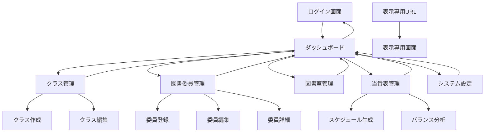

# フロントエンド設計書

バージョン: 1.0  
作成日: 2025年6月26日  
更新日: 2025年6月26日

## 1. 概要

### 1.1. ドキュメントの目的
本ドキュメントは、図書委員当番割り当てシステムのフロントエンド設計を定義し、画面構成、コンポーネント設計、状態管理、UI/UX設計を詳細に記述します。

### 1.2. 技術基盤
- **フレームワーク**: Next.js 15 (App Router)
- **UIライブラリ**: React 18 + TypeScript
- **スタイリング**: Tailwind CSS + shadcn/ui
- **状態管理**: React Context API + SWR
- **フォーム**: React Hook Form + Zod
- **認証**: Supabase Auth

### 1.3. 設計原則
1. **ユーザビリティ**: 直感的で使いやすいインターフェース
2. **アクセシビリティ**: WCAG 2.1 AA準拠
3. **レスポンシブ**: PC・タブレット両対応
4. **パフォーマンス**: 高速な表示・操作
5. **保守性**: 再利用可能なコンポーネント設計

## 2. 画面構成・ワイヤーフレーム

### 2.1. 画面一覧

| 画面名 | パス | 認証要件 | 説明 |
|--------|------|----------|------|
| **ログイン画面** | `/auth/login` | なし | システムログイン |
| **ダッシュボード** | `/dashboard` | 認証必須 | メイン画面・当番表表示 |
| **クラス管理** | `/admin/classes` | 管理者 | クラス登録・編集 |
| **図書委員管理** | `/admin/students` | 管理者 | 委員名簿管理 |
| **図書室管理** | `/admin/rooms` | 管理者 | 図書室設定 |
| **当番表管理** | `/admin/schedules` | 管理者 | スケジュール生成・管理 |
| **システム設定** | `/admin/settings` | 管理者 | システム設定 |
| **表示専用画面** | `/view` | トークン | 当番表閲覧専用 |

### 2.2. ワイヤーフレーム

#### 2.2.1. ログイン画面 (`/auth/login`)

```
┌─────────────────────────────────────────────────────────┐
│                                                         │
│                  ○○小学校                               │
│             図書委員当番システム                         │
│                                                         │
│         ┌─────────────────────────────────────┐         │
│         │                                     │         │
│         │  📧 [メールアドレス           ]    │         │
│         │                                     │         │
│         │  🔒 [パスワード               ]    │         │
│         │                                     │         │
│         │           [ログイン]                │         │
│         │                                     │         │
│         │         パスワードを忘れた場合       │         │
│         │                                     │         │
│         └─────────────────────────────────────┘         │
│                                                         │
└─────────────────────────────────────────────────────────┘
```

#### 2.2.2. ダッシュボード画面 (`/dashboard`)

```
┌─────────────────────────────────────────────────────────┐
│ [🏠 ダッシュボード] [⚙️ 管理] [👤 山田先生] [🚪 ログアウト] │
├─────────────────────────────────────────────────────────┤
│                                                         │
│  📅 今日の当番 (2025年6月26日 水曜日)                   │
│  ┌─────────────────────────────────────────────────────┐ │
│  │ 図書室A: 田中花子(5-1) 佐藤次郎(6-2)               │ │
│  │ 図書室B: 鈴木三郎(5-2) 高橋四郎(6-1)               │ │
│  └─────────────────────────────────────────────────────┘ │
│                                                         │
│  📊 前期 当番表                            [後期に切替] │
│  ┌─────┬─────┬─────┬─────┬─────┬─────────────┐ │
│  │     │ 月  │ 火  │ 水  │ 木  │ 金  │             │ │
│  ├─────┼─────┼─────┼─────┼─────┼─────────────┤ │
│  │図書 │田中  │佐藤  │山田  │鈴木  │高橋  │             │ │
│  │室A  │花子  │次郎  │五郎  │三郎  │四郎  │ [📄 印刷]   │ │
│  │     │(5-1) │(6-2) │(5-3) │(5-2) │(6-1) │             │ │
│  ├─────┼─────┼─────┼─────┼─────┼─────────────┤ │
│  │図書 │伊藤  │渡辺  │加藤  │小林  │中村  │ [⚙️ 管理]   │ │
│  │室B  │六郎  │七子  │八郎  │九子  │十郎  │             │ │
│  │     │(6-1) │(5-1) │(6-3) │(5-2) │(6-2) │             │ │
│  └─────┴─────┴─────┴─────┴─────┴─────────────┘ │
│                                                         │
│  📈 統計情報                                           │
│  ・図書委員総数: 24名 ・前期割当済: 24名                │
│  ・バランス: 各生徒週2回 ・未割当: 0名                 │
│                                                         │
└─────────────────────────────────────────────────────────┘
```

#### 2.2.3. 図書委員管理画面 (`/admin/students`)

```
┌─────────────────────────────────────────────────────────┐
│ [🏠 ダッシュボード] [⚙️ 管理] [👤 山田先生] [🚪 ログアウト] │
├─────────────────────────────────────────────────────────┤
│                                                         │
│  👥 図書委員名簿管理                                   │
│                                                         │
│  🔍 [検索...     ] [学年▼] [クラス▼] [➕ 新規追加]    │
│                                                         │
│  ┌─────────────────────────────────────────────────────┐ │
│  │ ✅ 氏名      │ 学年 │ クラス │ 当番回数 │ 操作    │ │
│  ├─────────────────────────────────────────────────────┤ │
│  │ ✅ 田中花子  │ 5年  │ 5-1   │ 2回     │[✏️][🗑️]│ │
│  │ ✅ 佐藤次郎  │ 6年  │ 6-2   │ 2回     │[✏️][🗑️]│ │
│  │ ✅ 山田五郎  │ 5年  │ 5-3   │ 2回     │[✏️][🗑️]│ │
│  │ ❌ 鈴木三郎  │ 5年  │ 5-2   │ 0回     │[✏️][🗑️]│ │
│  │ ✅ 高橋四郎  │ 6年  │ 6-1   │ 2回     │[✏️][🗑️]│ │
│  └─────────────────────────────────────────────────────┘ │
│                                                         │
│  📄 1-20 / 24件                        [前へ] [次へ]   │
│                                                         │
└─────────────────────────────────────────────────────────┘
```

#### 2.2.4. 当番表管理画面 (`/admin/schedules`)

```
┌─────────────────────────────────────────────────────────┐
│ [🏠 ダッシュボード] [⚙️ 管理] [👤 山田先生] [🚪 ログアウト] │
├─────────────────────────────────────────────────────────┤
│                                                         │
│  📅 当番表管理                                         │
│                                                         │
│  ⚡ [前期当番表を作成] [後期当番表を作成]               │
│                                                         │
│  📊 現在の当番表: 前期                 [後期に切替]    │
│  ┌─────────────────────────────────────────────────────┐ │
│  │ 📈 統計情報                                        │ │
│  │ ・総割当数: 48件  ・参加生徒: 24名                 │ │
│  │ ・平均回数: 2.0回 ・バランス: 良好                 │ │
│  └─────────────────────────────────────────────────────┘ │
│                                                         │
│  🔄 スケジュール操作                                   │
│  [🗑️ 当番表をリセット] [📊 バランス分析] [📄 印刷]     │
│                                                         │
│  📋 当番表                                             │
│  ┌─────┬─────┬─────┬─────┬─────┬─────────────┐ │
│  │     │ 月  │ 火  │ 水  │ 木  │ 金  │             │ │
│  ├─────┼─────┼─────┼─────┼─────┼─────────────┤ │
│  │図書 │田中  │佐藤  │山田  │鈴木  │高橋  │             │ │
│  │室A  │花子  │次郎  │五郎  │三郎  │四郎  │ 平均: 2.4名 │ │
│  │     │(5-1) │(6-2) │(5-3) │(5-2) │(6-1) │             │ │
│  ├─────┼─────┼─────┼─────┼─────┼─────────────┤ │
│  │図書 │伊藤  │渡辺  │加藤  │小林  │中村  │             │ │
│  │室B  │六郎  │七子  │八郎  │九子  │十郎  │ 平均: 2.4名 │ │
│  │     │(6-1) │(5-1) │(6-3) │(5-2) │(6-2) │             │ │
│  └─────┴─────┴─────┴─────┴─────┴─────────────┘ │
│                                                         │
└─────────────────────────────────────────────────────────┘
```

#### 2.2.5. 表示専用画面 (`/view`)

```
┌─────────────────────────────────────────────────────────┐
│                  ○○小学校 図書委員当番表                │
├─────────────────────────────────────────────────────────┤
│                                                         │
│  📅 今日の当番 (2025年6月26日 水曜日)                   │
│  ┌─────────────────────────────────────────────────────┐ │
│  │ 📚 図書室A: 田中花子(5-1) 佐藤次郎(6-2)            │ │
│  │ 📚 図書室B: 鈴木三郎(5-2) 高橋四郎(6-1)            │ │
│  └─────────────────────────────────────────────────────┘ │
│                                                         │
│  📊 前期 当番表                                        │
│  ┌─────┬─────┬─────┬─────┬─────┬─────────────┐ │
│  │     │ 月  │ 火  │ 水  │ 木  │ 金  │             │ │
│  ├─────┼─────┼─────┼─────┼─────┼─────────────┤ │
│  │📚   │田中  │佐藤  │山田  │鈴木  │高橋  │             │ │
│  │図書 │花子  │次郎  │五郎  │三郎  │四郎  │             │ │
│  │室A  │(5-1) │(6-2) │(5-3) │(5-2) │(6-1) │             │ │
│  ├─────┼─────┼─────┼─────┼─────┼─────────────┤ │
│  │📚   │伊藤  │渡辺  │加藤  │小林  │中村  │             │ │
│  │図書 │六郎  │七子  │八郎  │九子  │十郎  │             │ │
│  │室B  │(6-1) │(5-1) │(6-3) │(5-2) │(6-2) │             │ │
│  └─────┴─────┴─────┴─────┴─────┴─────────────┘ │
│                                                         │
│  🕐 最終更新: 2025年6月25日 14:30                      │
│                                                         │
└─────────────────────────────────────────────────────────┘
```

## 3. 画面遷移図

### 3.1. 全体画面遷移



### 3.2. ユーザーフロー

#### 3.2.1. 初期設定フロー
```
ログイン → ダッシュボード → クラス管理 → クラス作成
                         ↓
図書室管理 → 図書室作成 → 図書委員管理 → 委員登録
                         ↓
当番表管理 → スケジュール生成 → ダッシュボード
```

#### 3.2.2. 日常運用フロー
```
ログイン → ダッシュボード → 今日の当番確認
                     ↓
図書委員管理 → 委員情報更新（必要時）
                     ↓
当番表管理 → 再生成（必要時）
```

## 4. コンポーネント設計

### 4.1. ディレクトリ構造

```
src/
├── app/                        # Next.js App Router
│   ├── (admin)/               # 管理者向けルートグループ
│   │   ├── dashboard/
│   │   ├── classes/
│   │   ├── students/
│   │   ├── rooms/
│   │   ├── schedules/
│   │   └── settings/
│   ├── (public)/              # 公開ルートグループ
│   │   └── view/
│   ├── auth/
│   │   └── login/
│   ├── api/                   # API Routes
│   ├── globals.css
│   ├── layout.tsx
│   └── page.tsx
├── components/                 # UIコンポーネント
│   ├── ui/                    # shadcn/ui基底コンポーネント
│   │   ├── button.tsx
│   │   ├── card.tsx
│   │   ├── form.tsx
│   │   ├── table.tsx
│   │   └── ...
│   ├── layout/                # レイアウトコンポーネント
│   │   ├── header.tsx
│   │   ├── sidebar.tsx
│   │   ├── footer.tsx
│   │   └── page-layout.tsx
│   ├── forms/                 # フォームコンポーネント
│   │   ├── class-form.tsx
│   │   ├── student-form.tsx
│   │   └── login-form.tsx
│   ├── tables/                # テーブルコンポーネント
│   │   ├── students-table.tsx
│   │   ├── classes-table.tsx
│   │   └── schedule-table.tsx
│   ├── schedule/              # スケジュール関連
│   │   ├── schedule-grid.tsx
│   │   ├── today-assignments.tsx
│   │   └── schedule-stats.tsx
│   └── common/                # 共通コンポーネント
│       ├── loading-spinner.tsx
│       ├── error-boundary.tsx
│       ├── confirmation-dialog.tsx
│       └── pagination.tsx
├── lib/                       # ユーティリティ・サービス
│   ├── hooks/                 # カスタムフック
│   ├── services/              # APIサービス
│   ├── utils/                 # ユーティリティ関数
│   └── context/               # Reactコンテキスト
└── types/                     # 型定義
    ├── database.ts
    ├── api.ts
    └── ui.ts
```

### 4.2. 基底コンポーネント設計

#### 4.2.1. Button コンポーネント
```typescript
// components/ui/button.tsx
import { cn } from '@/lib/utils'
import { cva, type VariantProps } from 'class-variance-authority'

const buttonVariants = cva(
  'inline-flex items-center justify-center whitespace-nowrap rounded-md text-sm font-medium ring-offset-background transition-colors focus-visible:outline-none focus-visible:ring-2 focus-visible:ring-ring focus-visible:ring-offset-2 disabled:pointer-events-none disabled:opacity-50',
  {
    variants: {
      variant: {
        default: 'bg-primary text-primary-foreground hover:bg-primary/90',
        destructive: 'bg-destructive text-destructive-foreground hover:bg-destructive/90',
        outline: 'border border-input bg-background hover:bg-accent hover:text-accent-foreground',
        secondary: 'bg-secondary text-secondary-foreground hover:bg-secondary/80',
        ghost: 'hover:bg-accent hover:text-accent-foreground',
        link: 'text-primary underline-offset-4 hover:underline'
      },
      size: {
        default: 'h-10 px-4 py-2',
        sm: 'h-9 rounded-md px-3',
        lg: 'h-11 rounded-md px-8',
        icon: 'h-10 w-10'
      }
    },
    defaultVariants: {
      variant: 'default',
      size: 'default'
    }
  }
)

interface ButtonProps
  extends React.ButtonHTMLAttributes<HTMLButtonElement>,
    VariantProps<typeof buttonVariants> {
  asChild?: boolean
}

const Button = React.forwardRef<HTMLButtonElement, ButtonProps>(
  ({ className, variant, size, asChild = false, ...props }, ref) => {
    const Comp = asChild ? Slot : 'button'
    return (
      <Comp
        className={cn(buttonVariants({ variant, size, className }))}
        ref={ref}
        {...props}
      />
    )
  }
)
```

#### 4.2.2. Table コンポーネント
```typescript
// components/ui/table.tsx
const Table = React.forwardRef<HTMLTableElement, React.HTMLAttributes<HTMLTableElement>>(
  ({ className, ...props }, ref) => (
    <div className="relative w-full overflow-auto">
      <table
        ref={ref}
        className={cn('w-full caption-bottom text-sm', className)}
        {...props}
      />
    </div>
  )
)

const TableHeader = React.forwardRef<HTMLTableSectionElement, React.HTMLAttributes<HTMLTableSectionElement>>(
  ({ className, ...props }, ref) => (
    <thead ref={ref} className={cn('[&_tr]:border-b', className)} {...props} />
  )
)

const TableBody = React.forwardRef<HTMLTableSectionElement, React.HTMLAttributes<HTMLTableSectionElement>>(
  ({ className, ...props }, ref) => (
    <tbody
      ref={ref}
      className={cn('[&_tr:last-child]:border-0', className)}
      {...props}
    />
  )
)

const TableRow = React.forwardRef<HTMLTableRowElement, React.HTMLAttributes<HTMLTableRowElement>>(
  ({ className, ...props }, ref) => (
    <tr
      ref={ref}
      className={cn(
        'border-b transition-colors hover:bg-muted/50 data-[state=selected]:bg-muted',
        className
      )}
      {...props}
    />
  )
)

const TableCell = React.forwardRef<HTMLTableCellElement, React.TdHTMLAttributes<HTMLTableCellElement>>(
  ({ className, ...props }, ref) => (
    <td
      ref={ref}
      className={cn('p-4 align-middle [&:has([role=checkbox])]:pr-0', className)}
      {...props}
    />
  )
)
```

### 4.3. レイアウトコンポーネント

#### 4.3.1. ページレイアウト
```typescript
// components/layout/page-layout.tsx
interface PageLayoutProps {
  children: React.ReactNode
  title: string
  description?: string
  actions?: React.ReactNode
}

export function PageLayout({
  children,
  title,
  description,
  actions
}: PageLayoutProps) {
  return (
    <div className="container mx-auto py-6 space-y-6">
      <div className="flex items-center justify-between">
        <div>
          <h1 className="text-3xl font-bold tracking-tight">{title}</h1>
          {description && (
            <p className="text-muted-foreground">{description}</p>
          )}
        </div>
        {actions && <div className="flex items-center gap-2">{actions}</div>}
      </div>
      {children}
    </div>
  )
}
```

#### 4.3.2. ヘッダーコンポーネント
```typescript
// components/layout/header.tsx
export function Header() {
  const { user, signOut } = useAuth()
  
  return (
    <header className="border-b">
      <div className="container mx-auto px-4 py-3">
        <div className="flex items-center justify-between">
          <div className="flex items-center gap-4">
            <Link href="/dashboard" className="text-xl font-bold">
              📚 図書委員当番システム
            </Link>
            <nav className="hidden md:flex items-center gap-4">
              <Link href="/dashboard" className="text-sm font-medium">
                ダッシュボード
              </Link>
              <DropdownMenu>
                <DropdownMenuTrigger asChild>
                  <Button variant="ghost" size="sm">
                    管理 <ChevronDown className="ml-1 h-4 w-4" />
                  </Button>
                </DropdownMenuTrigger>
                <DropdownMenuContent>
                  <DropdownMenuItem asChild>
                    <Link href="/admin/classes">クラス管理</Link>
                  </DropdownMenuItem>
                  <DropdownMenuItem asChild>
                    <Link href="/admin/students">図書委員管理</Link>
                  </DropdownMenuItem>
                  <DropdownMenuItem asChild>
                    <Link href="/admin/rooms">図書室管理</Link>
                  </DropdownMenuItem>
                  <DropdownMenuItem asChild>
                    <Link href="/admin/schedules">当番表管理</Link>
                  </DropdownMenuItem>
                  <DropdownMenuSeparator />
                  <DropdownMenuItem asChild>
                    <Link href="/admin/settings">システム設定</Link>
                  </DropdownMenuItem>
                </DropdownMenuContent>
              </DropdownMenu>
            </nav>
          </div>
          <div className="flex items-center gap-2">
            <span className="text-sm text-muted-foreground">
              👤 {user?.displayName || user?.email}
            </span>
            <Button
              variant="ghost"
              size="sm"
              onClick={() => signOut()}
            >
              ログアウト
            </Button>
          </div>
        </div>
      </div>
    </header>
  )
}
```

### 4.4. フォームコンポーネント

#### 4.4.1. 図書委員フォーム
```typescript
// components/forms/student-form.tsx
import { useForm } from 'react-hook-form'
import { zodResolver } from '@hookform/resolvers/zod'
import { z } from 'zod'

const studentSchema = z.object({
  name: z.string().min(1, '名前は必須です').max(50, '名前は50文字以内で入力してください'),
  classId: z.string().min(1, 'クラスを選択してください'),
  grade: z.number().min(5).max(6, '学年は5年または6年を選択してください')
})

type StudentFormData = z.infer<typeof studentSchema>

interface StudentFormProps {
  initialData?: Partial<StudentFormData>
  onSubmit: (data: StudentFormData) => Promise<void>
  onCancel: () => void
  isLoading?: boolean
}

export function StudentForm({
  initialData,
  onSubmit,
  onCancel,
  isLoading = false
}: StudentFormProps) {
  const { data: classes } = useClasses()
  
  const form = useForm<StudentFormData>({
    resolver: zodResolver(studentSchema),
    defaultValues: initialData || {
      name: '',
      classId: '',
      grade: 5
    }
  })

  const handleSubmit = async (data: StudentFormData) => {
    try {
      await onSubmit(data)
      form.reset()
    } catch (error) {
      console.error('Form submission error:', error)
    }
  }

  return (
    <Form {...form}>
      <form onSubmit={form.handleSubmit(handleSubmit)} className="space-y-4">
        <FormField
          control={form.control}
          name="name"
          render={({ field }) => (
            <FormItem>
              <FormLabel>氏名</FormLabel>
              <FormControl>
                <Input
                  placeholder="山田太郎"
                  {...field}
                />
              </FormControl>
              <FormMessage />
            </FormItem>
          )}
        />
        
        <div className="grid grid-cols-2 gap-4">
          <FormField
            control={form.control}
            name="grade"
            render={({ field }) => (
              <FormItem>
                <FormLabel>学年</FormLabel>
                <Select
                  onValueChange={(value) => field.onChange(parseInt(value))}
                  defaultValue={field.value?.toString()}
                >
                  <FormControl>
                    <SelectTrigger>
                      <SelectValue placeholder="学年を選択" />
                    </SelectTrigger>
                  </FormControl>
                  <SelectContent>
                    <SelectItem value="5">5年</SelectItem>
                    <SelectItem value="6">6年</SelectItem>
                  </SelectContent>
                </Select>
                <FormMessage />
              </FormItem>
            )}
          />
          
          <FormField
            control={form.control}
            name="classId"
            render={({ field }) => (
              <FormItem>
                <FormLabel>クラス</FormLabel>
                <Select onValueChange={field.onChange} defaultValue={field.value}>
                  <FormControl>
                    <SelectTrigger>
                      <SelectValue placeholder="クラスを選択" />
                    </SelectTrigger>
                  </FormControl>
                  <SelectContent>
                    {classes?.map((cls) => (
                      <SelectItem key={cls.id} value={cls.id}>
                        {cls.name}
                      </SelectItem>
                    ))}
                  </SelectContent>
                </Select>
                <FormMessage />
              </FormItem>
            )}
          />
        </div>

        <div className="flex items-center gap-2">
          <Button type="submit" disabled={isLoading}>
            {isLoading && <Loader2 className="mr-2 h-4 w-4 animate-spin" />}
            {initialData ? '更新' : '作成'}
          </Button>
          <Button type="button" variant="outline" onClick={onCancel}>
            キャンセル
          </Button>
        </div>
      </form>
    </Form>
  )
}
```

### 4.5. スケジュール関連コンポーネント

#### 4.5.1. 当番表グリッド
```typescript
// components/schedule/schedule-grid.tsx
interface ScheduleGridProps {
  schedules: ScheduleData
  term: 'FIRST_TERM' | 'SECOND_TERM'
  isViewOnly?: boolean
}

export function ScheduleGrid({ schedules, term, isViewOnly = false }: ScheduleGridProps) {
  const { data: rooms } = useRooms()
  
  const dayNames = ['月', '火', '水', '木', '金']
  const today = new Date().getDay() // 1-7 (月-日)
  const todayIndex = today === 0 ? 6 : today - 1 // 0-6 (月-日)

  return (
    <div className="overflow-x-auto">
      <table className="w-full border-collapse border border-gray-300">
        <thead>
          <tr>
            <th className="border border-gray-300 bg-gray-50 p-3 text-left">
              図書室
            </th>
            {dayNames.map((day, index) => (
              <th
                key={day}
                className={cn(
                  'border border-gray-300 bg-gray-50 p-3 text-center min-w-[120px]',
                  index === todayIndex && 'bg-blue-100'
                )}
              >
                {day}
                {index === todayIndex && (
                  <div className="text-xs text-blue-600 mt-1">今日</div>
                )}
              </th>
            ))}
            {!isViewOnly && (
              <th className="border border-gray-300 bg-gray-50 p-3 text-center">
                統計
              </th>
            )}
          </tr>
        </thead>
        <tbody>
          {rooms?.map((room) => (
            <tr key={room.id}>
              <td className="border border-gray-300 bg-gray-50 p-3 font-medium">
                📚 {room.name}
              </td>
              {[1, 2, 3, 4, 5].map((dayOfWeek) => {
                const assignments = schedules[dayOfWeek]?.[room.id] || []
                const isToday = dayOfWeek - 1 === todayIndex
                
                return (
                  <td
                    key={dayOfWeek}
                    className={cn(
                      'border border-gray-300 p-2 text-sm',
                      isToday && 'bg-blue-50'
                    )}
                  >
                    <div className="space-y-1">
                      {assignments.map((assignment) => (
                        <div
                          key={assignment.id}
                          className={cn(
                            'rounded-md p-2 text-center',
                            assignment.student.grade === 5 
                              ? 'bg-green-100 text-green-800'
                              : 'bg-blue-100 text-blue-800'
                          )}
                        >
                          <div className="font-medium">
                            {assignment.student.name}
                          </div>
                          <div className="text-xs">
                            ({assignment.student.class.name})
                          </div>
                        </div>
                      ))}
                      {assignments.length === 0 && (
                        <div className="text-gray-400 text-center py-4">
                          未割当
                        </div>
                      )}
                    </div>
                  </td>
                )
              })}
              {!isViewOnly && (
                <td className="border border-gray-300 p-3 text-center text-sm">
                  平均: {calculateRoomAverage(schedules, room.id)}名
                </td>
              )}
            </tr>
          ))}
        </tbody>
      </table>
    </div>
  )
}
```

#### 4.5.2. 今日の当番表示
```typescript
// components/schedule/today-assignments.tsx
export function TodayAssignments() {
  const today = new Date()
  const dayOfWeek = today.getDay() === 0 ? 7 : today.getDay() // 1-7 (月-日)
  
  const { data: todaySchedule, isLoading } = useTodaySchedule(dayOfWeek)
  
  if (isLoading) {
    return <LoadingSpinner />
  }
  
  if (!todaySchedule || Object.keys(todaySchedule).length === 0) {
    return (
      <Card>
        <CardHeader>
          <CardTitle>📅 今日の当番</CardTitle>
        </CardHeader>
        <CardContent>
          <p className="text-muted-foreground">
            今日は当番がありません
          </p>
        </CardContent>
      </Card>
    )
  }

  return (
    <Card>
      <CardHeader>
        <CardTitle>📅 今日の当番</CardTitle>
        <CardDescription>
          {formatDate(today)} ({getDayName(dayOfWeek)})
        </CardDescription>
      </CardHeader>
      <CardContent>
        <div className="space-y-3">
          {Object.entries(todaySchedule).map(([roomId, assignments]) => (
            <div
              key={roomId}
              className="flex items-center gap-3 p-3 rounded-lg bg-muted"
            >
              <div className="font-medium">
                📚 {assignments[0]?.room.name}:
              </div>
              <div className="flex flex-wrap gap-2">
                {assignments.map((assignment) => (
                  <Badge
                    key={assignment.id}
                    variant={assignment.student.grade === 5 ? 'default' : 'secondary'}
                  >
                    {assignment.student.name}({assignment.student.class.name})
                  </Badge>
                ))}
              </div>
            </div>
          ))}
        </div>
      </CardContent>
    </Card>
  )
}
```

## 5. 状態管理設計

### 5.1. React Context + SWR

#### 5.1.1. 認証コンテキスト
```typescript
// lib/context/auth-context.tsx
interface AuthContextType {
  user: User | null
  isLoading: boolean
  signIn: (email: string, password: string) => Promise<void>
  signOut: () => Promise<void>
  refetch: () => void
}

const AuthContext = createContext<AuthContextType | undefined>(undefined)

export function AuthProvider({ children }: { children: React.ReactNode }) {
  const [user, setUser] = useState<User | null>(null)
  const [isLoading, setIsLoading] = useState(true)

  useEffect(() => {
    const supabase = createClient()
    
    // 初期セッション取得
    supabase.auth.getSession().then(({ data: { session } }) => {
      setUser(session?.user ?? null)
      setIsLoading(false)
    })

    // 認証状態変更の監視
    const {
      data: { subscription }
    } = supabase.auth.onAuthStateChange((_event, session) => {
      setUser(session?.user ?? null)
      setIsLoading(false)
    })

    return () => subscription.unsubscribe()
  }, [])

  const signIn = async (email: string, password: string) => {
    const supabase = createClient()
    const { error } = await supabase.auth.signInWithPassword({
      email,
      password
    })
    
    if (error) {
      throw new Error(error.message)
    }
  }

  const signOut = async () => {
    const supabase = createClient()
    await supabase.auth.signOut()
  }

  const refetch = () => {
    // 認証状態を強制的に再取得
    setIsLoading(true)
    const supabase = createClient()
    supabase.auth.getSession().then(({ data: { session } }) => {
      setUser(session?.user ?? null)
      setIsLoading(false)
    })
  }

  return (
    <AuthContext.Provider
      value={{
        user,
        isLoading,
        signIn,
        signOut,
        refetch
      }}
    >
      {children}
    </AuthContext.Provider>
  )
}

export function useAuth() {
  const context = useContext(AuthContext)
  if (context === undefined) {
    throw new Error('useAuth must be used within an AuthProvider')
  }
  return context
}
```

#### 5.1.2. SWRカスタムフック
```typescript
// lib/hooks/use-students.ts
export function useStudents(params?: StudentsQueryParams) {
  const queryString = params ? `?${new URLSearchParams(params as any).toString()}` : ''
  
  const { data, error, mutate } = useSWR<StudentsResponse>(
    `/api/students${queryString}`,
    fetcher,
    {
      revalidateOnFocus: false,
      revalidateIfStale: false,
      revalidateOnReconnect: false
    }
  )

  return {
    students: data?.data.students || [],
    pagination: data?.data.pagination,
    isLoading: !error && !data,
    isError: error,
    mutate
  }
}

export function useStudent(id: string) {
  const { data, error, mutate } = useSWR<StudentResponse>(
    id ? `/api/students/${id}` : null,
    fetcher
  )

  return {
    student: data?.data.student,
    isLoading: !error && !data,
    isError: error,
    mutate
  }
}

// CRUD操作のためのカスタムフック
export function useCreateStudent() {
  const { mutate: mutateStudents } = useSWR('/api/students')
  
  return async (data: CreateStudentData) => {
    const response = await fetch('/api/students', {
      method: 'POST',
      headers: { 'Content-Type': 'application/json' },
      body: JSON.stringify(data)
    })
    
    if (!response.ok) {
      throw new Error('Failed to create student')
    }
    
    // SWRキャッシュを更新
    mutateStudents()
    
    return response.json()
  }
}
```

### 5.2. データフロー設計

```
┌─────────────────┐    ┌─────────────────┐    ┌─────────────────┐
│   Component     │───▶│   Custom Hook   │───▶│   API Route     │
│                 │    │   (SWR)         │    │                 │
└─────────────────┘    └─────────────────┘    └─────────────────┘
         ▲                       ▲                       │
         │                       │                       ▼
         │                       │              ┌─────────────────┐
         │              ┌─────────────────┐     │   Database      │
         │              │   SWR Cache     │     │   (Supabase)    │
         │              │                 │     │                 │
         └──────────────│   Automatic     │     └─────────────────┘
                        │   Revalidation  │
                        └─────────────────┘
```

## 6. レスポンシブデザイン

### 6.1. ブレークポイント設計

```typescript
// Tailwind CSS ブレークポイント
const breakpoints = {
  sm: '640px',   // タブレット縦向き
  md: '768px',   // タブレット横向き
  lg: '1024px',  // デスクトップ小
  xl: '1280px',  // デスクトップ大
  '2xl': '1536px' // デスクトップ特大
}
```

### 6.2. レスポンシブレイアウト実装

#### 6.2.1. ヘッダー
```typescript
// components/layout/header.tsx (レスポンシブ対応)
export function Header() {
  const [isMobileMenuOpen, setIsMobileMenuOpen] = useState(false)
  
  return (
    <header className="border-b">
      <div className="container mx-auto px-4 py-3">
        <div className="flex items-center justify-between">
          <div className="flex items-center gap-4">
            <Link href="/dashboard" className="text-lg md:text-xl font-bold">
              📚 図書委員当番システム
            </Link>
            
            {/* デスクトップナビゲーション */}
            <nav className="hidden md:flex items-center gap-4">
              <Link href="/dashboard" className="text-sm font-medium">
                ダッシュボード
              </Link>
              <DropdownMenu>
                <DropdownMenuTrigger asChild>
                  <Button variant="ghost" size="sm">
                    管理 <ChevronDown className="ml-1 h-4 w-4" />
                  </Button>
                </DropdownMenuTrigger>
                <DropdownMenuContent>
                  {/* メニュー項目 */}
                </DropdownMenuContent>
              </DropdownMenu>
            </nav>
          </div>
          
          <div className="flex items-center gap-2">
            {/* ユーザー情報 - デスクトップ */}
            <div className="hidden md:flex items-center gap-2">
              <span className="text-sm text-muted-foreground">
                👤 {user?.displayName || user?.email}
              </span>
              <Button variant="ghost" size="sm" onClick={() => signOut()}>
                ログアウト
              </Button>
            </div>
            
            {/* モバイルメニューボタン */}
            <Button
              variant="ghost"
              size="sm"
              className="md:hidden"
              onClick={() => setIsMobileMenuOpen(!isMobileMenuOpen)}
            >
              <Menu className="h-4 w-4" />
            </Button>
          </div>
        </div>
        
        {/* モバイルメニュー */}
        {isMobileMenuOpen && (
          <div className="md:hidden mt-4 space-y-2">
            <Link
              href="/dashboard"
              className="block px-3 py-2 rounded-md text-sm font-medium hover:bg-accent"
            >
              ダッシュボード
            </Link>
            <Link
              href="/admin/students"
              className="block px-3 py-2 rounded-md text-sm font-medium hover:bg-accent"
            >
              図書委員管理
            </Link>
            {/* その他のメニュー項目 */}
            <div className="border-t pt-2">
              <div className="px-3 py-2 text-sm text-muted-foreground">
                👤 {user?.displayName || user?.email}
              </div>
              <Button
                variant="ghost"
                size="sm"
                className="w-full justify-start"
                onClick={() => signOut()}
              >
                ログアウト
              </Button>
            </div>
          </div>
        )}
      </div>
    </header>
  )
}
```

#### 6.2.2. テーブル（レスポンシブ対応）
```typescript
// components/tables/students-table.tsx
export function StudentsTable({ students }: StudentsTableProps) {
  return (
    <>
      {/* デスクトップテーブル */}
      <div className="hidden md:block">
        <Table>
          <TableHeader>
            <TableRow>
              <TableHead>氏名</TableHead>
              <TableHead>学年</TableHead>
              <TableHead>クラス</TableHead>
              <TableHead>当番回数</TableHead>
              <TableHead>ステータス</TableHead>
              <TableHead>操作</TableHead>
            </TableRow>
          </TableHeader>
          <TableBody>
            {students.map((student) => (
              <TableRow key={student.id}>
                <TableCell className="font-medium">{student.name}</TableCell>
                <TableCell>{student.grade}年</TableCell>
                <TableCell>{student.class.name}</TableCell>
                <TableCell>{student.assignmentCount}回</TableCell>
                <TableCell>
                  <Badge variant={student.isActive ? 'default' : 'secondary'}>
                    {student.isActive ? 'アクティブ' : '非アクティブ'}
                  </Badge>
                </TableCell>
                <TableCell>
                  <div className="flex items-center gap-2">
                    <Button variant="ghost" size="sm">
                      <Edit className="h-4 w-4" />
                    </Button>
                    <Button variant="ghost" size="sm">
                      <Trash className="h-4 w-4" />
                    </Button>
                  </div>
                </TableCell>
              </TableRow>
            ))}
          </TableBody>
        </Table>
      </div>
      
      {/* モバイルカード表示 */}
      <div className="md:hidden space-y-3">
        {students.map((student) => (
          <Card key={student.id}>
            <CardContent className="p-4">
              <div className="flex items-center justify-between mb-2">
                <h3 className="font-medium">{student.name}</h3>
                <Badge variant={student.isActive ? 'default' : 'secondary'}>
                  {student.isActive ? 'アクティブ' : '非アクティブ'}
                </Badge>
              </div>
              <div className="text-sm text-muted-foreground space-y-1">
                <div>{student.grade}年 {student.class.name}</div>
                <div>当番回数: {student.assignmentCount}回</div>
              </div>
              <div className="flex items-center gap-2 mt-3">
                <Button variant="outline" size="sm">
                  <Edit className="h-4 w-4 mr-1" />
                  編集
                </Button>
                <Button variant="outline" size="sm">
                  <Trash className="h-4 w-4 mr-1" />
                  削除
                </Button>
              </div>
            </CardContent>
          </Card>
        ))}
      </div>
    </>
  )
}
```

### 6.3. 印刷最適化

#### 6.3.1. 印刷専用CSS
```css
/* globals.css - 印刷スタイル */
@media print {
  @page {
    size: A4;
    margin: 10mm;
  }
  
  /* ヘッダー・フッター・サイドバーを非表示 */
  .no-print {
    display: none !important;
  }
  
  /* 当番表の印刷最適化 */
  .schedule-table {
    font-size: 12px;
    page-break-inside: avoid;
    width: 100%;
  }
  
  .schedule-table th,
  .schedule-table td {
    border: 1px solid #000;
    padding: 4px;
    text-align: center;
  }
  
  .schedule-table th {
    background-color: #f0f0f0 !important;
    font-weight: bold;
  }
  
  /* カラー印刷対応 */
  .grade-5 {
    background-color: #e8f5e8 !important;
  }
  
  .grade-6 {
    background-color: #e8f0ff !important;
  }
  
  /* 今日のハイライトを印刷時は無効化 */
  .today-highlight {
    background-color: transparent !important;
  }
}
```

#### 6.3.2. 印刷専用コンポーネント
```typescript
// components/schedule/printable-schedule.tsx
interface PrintableScheduleProps {
  schedules: ScheduleData
  term: 'FIRST_TERM' | 'SECOND_TERM'
  schoolName?: string
}

export function PrintableSchedule({
  schedules,
  term,
  schoolName = '○○小学校'
}: PrintableScheduleProps) {
  return (
    <div className="print:block hidden">
      <div className="text-center mb-6">
        <h1 className="text-2xl font-bold mb-2">{schoolName}</h1>
        <h2 className="text-xl font-semibold">
          図書委員当番表（{term === 'FIRST_TERM' ? '前期' : '後期'}）
        </h2>
        <p className="text-sm text-gray-600 mt-2">
          作成日: {formatDate(new Date())}
        </p>
      </div>
      
      <ScheduleGrid 
        schedules={schedules} 
        term={term} 
        isViewOnly 
        className="schedule-table"
      />
      
      <div className="mt-6 text-sm">
        <p>※ 緑色は5年生、青色は6年生を表示</p>
        <p>※ 各図書委員は週2回の当番を担当</p>
      </div>
    </div>
  )
}
```

## 7. アクセシビリティ設計

### 7.1. ARIA属性の実装

```typescript
// components/ui/button.tsx (アクセシビリティ対応)
const Button = React.forwardRef<HTMLButtonElement, ButtonProps>(
  ({ className, variant, size, disabled, children, ...props }, ref) => {
    return (
      <button
        className={cn(buttonVariants({ variant, size, className }))}
        ref={ref}
        disabled={disabled}
        aria-disabled={disabled}
        {...props}
      >
        {children}
      </button>
    )
  }
)
```

### 7.2. キーボードナビゲーション

```typescript
// components/layout/navigation.tsx
export function Navigation() {
  const [focusedIndex, setFocusedIndex] = useState(0)
  
  const handleKeyDown = (event: React.KeyboardEvent) => {
    if (event.key === 'ArrowDown') {
      event.preventDefault()
      setFocusedIndex((prev) => (prev + 1) % menuItems.length)
    } else if (event.key === 'ArrowUp') {
      event.preventDefault()
      setFocusedIndex((prev) => (prev - 1 + menuItems.length) % menuItems.length)
    } else if (event.key === 'Enter' || event.key === ' ') {
      event.preventDefault()
      // アクティブなメニュー項目を実行
    }
  }
  
  return (
    <nav
      role="navigation"
      aria-label="メインナビゲーション"
      onKeyDown={handleKeyDown}
    >
      {menuItems.map((item, index) => (
        <Link
          key={item.href}
          href={item.href}
          className={cn(
            'block px-3 py-2 rounded-md text-sm font-medium',
            index === focusedIndex && 'bg-accent'
          )}
          aria-current={index === focusedIndex ? 'page' : undefined}
        >
          {item.label}
        </Link>
      ))}
    </nav>
  )
}
```

### 7.3. スクリーンリーダー対応

```typescript
// components/schedule/schedule-grid.tsx (アクセシビリティ対応)
export function ScheduleGrid({ schedules, term }: ScheduleGridProps) {
  return (
    <div role="region" aria-label={`${term === 'FIRST_TERM' ? '前期' : '後期'}の当番表`}>
      <table
        role="table"
        aria-label="図書委員当番表"
        className="w-full border-collapse"
      >
        <caption className="sr-only">
          図書委員の当番スケジュール。月曜日から金曜日まで、各図書室の担当者を表示しています。
        </caption>
        <thead>
          <tr role="row">
            <th
              role="columnheader"
              scope="col"
              className="border border-gray-300 bg-gray-50 p-3"
            >
              図書室
            </th>
            {dayNames.map((day, index) => (
              <th
                key={day}
                role="columnheader"
                scope="col"
                className="border border-gray-300 bg-gray-50 p-3"
                aria-label={`${day}曜日の当番`}
              >
                {day}
              </th>
            ))}
          </tr>
        </thead>
        <tbody>
          {rooms?.map((room) => (
            <tr key={room.id} role="row">
              <th
                role="rowheader"
                scope="row"
                className="border border-gray-300 bg-gray-50 p-3"
              >
                {room.name}
              </th>
              {[1, 2, 3, 4, 5].map((dayOfWeek) => {
                const assignments = schedules[dayOfWeek]?.[room.id] || []
                
                return (
                  <td
                    key={dayOfWeek}
                    role="cell"
                    className="border border-gray-300 p-2"
                    aria-label={`${room.name}の${dayNames[dayOfWeek - 1]}曜日: ${
                      assignments.length > 0
                        ? assignments.map(a => `${a.student.name}（${a.student.class.name}）`).join('、')
                        : '担当者なし'
                    }`}
                  >
                    <div className="space-y-1">
                      {assignments.map((assignment) => (
                        <div
                          key={assignment.id}
                          className="rounded-md p-2 text-center"
                        >
                          <div className="font-medium">
                            {assignment.student.name}
                          </div>
                          <div className="text-xs">
                            ({assignment.student.class.name})
                          </div>
                        </div>
                      ))}
                    </div>
                  </td>
                )
              })}
            </tr>
          ))}
        </tbody>
      </table>
    </div>
  )
}
```

## 8. パフォーマンス最適化

### 8.1. React最適化

#### 8.1.1. メモ化の活用
```typescript
// components/schedule/schedule-stats.tsx
export const ScheduleStats = React.memo(function ScheduleStats({
  schedules,
  students
}: ScheduleStatsProps) {
  const stats = useMemo(() => {
    return calculateScheduleStatistics(schedules, students)
  }, [schedules, students])
  
  return (
    <Card>
      <CardHeader>
        <CardTitle>📈 統計情報</CardTitle>
      </CardHeader>
      <CardContent>
        <div className="grid grid-cols-2 md:grid-cols-4 gap-4">
          <div className="text-center">
            <div className="text-2xl font-bold">{stats.totalStudents}</div>
            <div className="text-sm text-muted-foreground">図書委員総数</div>
          </div>
          <div className="text-center">
            <div className="text-2xl font-bold">{stats.assignedStudents}</div>
            <div className="text-sm text-muted-foreground">割当済</div>
          </div>
          <div className="text-center">
            <div className="text-2xl font-bold">{stats.averageAssignments.toFixed(1)}</div>
            <div className="text-sm text-muted-foreground">平均回数</div>
          </div>
          <div className="text-center">
            <div className="text-2xl font-bold">{stats.balanceScore}%</div>
            <div className="text-sm text-muted-foreground">バランス</div>
          </div>
        </div>
      </CardContent>
    </Card>
  )
})
```

#### 8.1.2. 仮想化（大量データ対応）
```typescript
// components/tables/virtualized-table.tsx (将来拡張用)
import { FixedSizeList as List } from 'react-window'

interface VirtualizedTableProps<T> {
  items: T[]
  height: number
  itemHeight: number
  renderItem: (props: { index: number; style: React.CSSProperties }) => React.ReactElement
}

export function VirtualizedTable<T>({
  items,
  height,
  itemHeight,
  renderItem
}: VirtualizedTableProps<T>) {
  return (
    <List
      height={height}
      itemCount={items.length}
      itemSize={itemHeight}
      className="border border-gray-300"
    >
      {renderItem}
    </List>
  )
}
```

### 8.2. 画像・アセット最適化

#### 8.2.1. アイコン最適化
```typescript
// components/ui/icon.tsx
import { LucideIcon } from 'lucide-react'

interface IconProps {
  icon: LucideIcon
  size?: 'sm' | 'md' | 'lg'
  className?: string
}

export function Icon({ icon: IconComponent, size = 'md', className }: IconProps) {
  const sizeClasses = {
    sm: 'h-4 w-4',
    md: 'h-5 w-5',
    lg: 'h-6 w-6'
  }
  
  return (
    <IconComponent 
      className={cn(sizeClasses[size], className)}
      aria-hidden="true"
    />
  )
}
```

### 8.3. バンドル最適化

#### 8.3.1. 動的インポート
```typescript
// app/admin/schedules/page.tsx
import dynamic from 'next/dynamic'

// 重い分析コンポーネントは動的インポート
const ScheduleAnalyzer = dynamic(
  () => import('@/components/schedule/schedule-analyzer'),
  {
    loading: () => <LoadingSpinner />,
    ssr: false
  }
)

export default function SchedulesPage() {
  const [showAnalyzer, setShowAnalyzer] = useState(false)
  
  return (
    <div>
      {/* 基本コンポーネント */}
      <ScheduleGrid />
      
      {/* 分析機能は必要時のみロード */}
      {showAnalyzer && <ScheduleAnalyzer />}
    </div>
  )
}
```

## 9. エラーハンドリング・ローディング

### 9.1. エラーバウンダリ

```typescript
// components/common/error-boundary.tsx
interface ErrorBoundaryProps {
  children: React.ReactNode
  fallback?: React.ComponentType<{ error: Error; resetError: () => void }>
}

export function ErrorBoundary({ children, fallback: Fallback }: ErrorBoundaryProps) {
  return (
    <ReactErrorBoundary
      FallbackComponent={Fallback || DefaultErrorFallback}
      onError={(error, errorInfo) => {
        console.error('Error caught by boundary:', error, errorInfo)
        // エラー監視サービスに送信
      }}
    >
      {children}
    </ReactErrorBoundary>
  )
}

function DefaultErrorFallback({ error, resetErrorBoundary }: ErrorFallbackProps) {
  return (
    <Card className="max-w-lg mx-auto mt-8">
      <CardHeader>
        <CardTitle className="text-red-600">エラーが発生しました</CardTitle>
      </CardHeader>
      <CardContent>
        <p className="text-muted-foreground mb-4">
          申し訳ございません。予期しないエラーが発生しました。
        </p>
        <details className="mb-4">
          <summary className="cursor-pointer text-sm">詳細を表示</summary>
          <pre className="mt-2 text-xs bg-gray-100 p-2 rounded overflow-x-auto">
            {error.message}
          </pre>
        </details>
        <div className="flex gap-2">
          <Button onClick={resetErrorBoundary}>
            再試行
          </Button>
          <Button variant="outline" onClick={() => window.location.reload()}>
            ページを再読み込み
          </Button>
        </div>
      </CardContent>
    </Card>
  )
}
```

### 9.2. ローディング状態

```typescript
// components/common/loading-spinner.tsx
interface LoadingSpinnerProps {
  size?: 'sm' | 'md' | 'lg'
  text?: string
}

export function LoadingSpinner({ size = 'md', text }: LoadingSpinnerProps) {
  const sizeClasses = {
    sm: 'h-4 w-4',
    md: 'h-6 w-6',
    lg: 'h-8 w-8'
  }
  
  return (
    <div className="flex flex-col items-center justify-center p-4">
      <Loader2 className={cn('animate-spin', sizeClasses[size])} />
      {text && <p className="mt-2 text-sm text-muted-foreground">{text}</p>}
    </div>
  )
}

// ページレベルローディング
export function PageLoading() {
  return (
    <div className="min-h-screen flex items-center justify-center">
      <LoadingSpinner size="lg" text="読み込み中..." />
    </div>
  )
}

// テーブルローディング
export function TableLoading({ rows = 5 }: { rows?: number }) {
  return (
    <div className="space-y-3">
      {Array.from({ length: rows }).map((_, i) => (
        <div key={i} className="flex space-x-4">
          <Skeleton className="h-4 w-[100px]" />
          <Skeleton className="h-4 w-[150px]" />
          <Skeleton className="h-4 w-[100px]" />
          <Skeleton className="h-4 w-[80px]" />
        </div>
      ))}
    </div>
  )
}
```

## 10. テスト戦略

### 10.1. コンポーネントテスト

```typescript
// __tests__/components/student-form.test.tsx
import { render, screen, fireEvent, waitFor } from '@testing-library/react'
import { StudentForm } from '@/components/forms/student-form'

describe('StudentForm', () => {
  const mockOnSubmit = jest.fn()
  const mockOnCancel = jest.fn()

  beforeEach(() => {
    jest.clearAllMocks()
  })

  it('renders form fields correctly', () => {
    render(
      <StudentForm onSubmit={mockOnSubmit} onCancel={mockOnCancel} />
    )

    expect(screen.getByLabelText('氏名')).toBeInTheDocument()
    expect(screen.getByLabelText('学年')).toBeInTheDocument()
    expect(screen.getByLabelText('クラス')).toBeInTheDocument()
  })

  it('validates required fields', async () => {
    render(
      <StudentForm onSubmit={mockOnSubmit} onCancel={mockOnCancel} />
    )

    fireEvent.click(screen.getByRole('button', { name: '作成' }))

    await waitFor(() => {
      expect(screen.getByText('名前は必須です')).toBeInTheDocument()
    })

    expect(mockOnSubmit).not.toHaveBeenCalled()
  })

  it('submits form with valid data', async () => {
    render(
      <StudentForm onSubmit={mockOnSubmit} onCancel={mockOnCancel} />
    )

    fireEvent.change(screen.getByLabelText('氏名'), {
      target: { value: '山田太郎' }
    })
    
    fireEvent.click(screen.getByRole('button', { name: '作成' }))

    await waitFor(() => {
      expect(mockOnSubmit).toHaveBeenCalledWith({
        name: '山田太郎',
        classId: expect.any(String),
        grade: expect.any(Number)
      })
    })
  })
})
```

### 10.2. ユーザビリティテスト

```typescript
// __tests__/e2e/user-flow.test.ts
import { test, expect } from '@playwright/test'

test.describe('Teacher User Flow', () => {
  test('should complete schedule creation flow', async ({ page }) => {
    // ログイン
    await page.goto('/auth/login')
    await page.fill('[name="email"]', 'teacher@example.com')
    await page.fill('[name="password"]', 'password')
    await page.click('button[type="submit"]')

    // ダッシュボードへ遷移
    await expect(page).toHaveURL('/dashboard')
    await expect(page.locator('h1')).toContainText('ダッシュボード')

    // クラス作成
    await page.click('text=管理')
    await page.click('text=クラス管理')
    await page.click('text=新規追加')
    await page.fill('[name="name"]', '5年1組')
    await page.selectOption('[name="year"]', '5')
    await page.click('button[type="submit"]')

    // 図書委員登録
    await page.click('text=図書委員管理')
    await page.click('text=新規追加')
    await page.fill('[name="name"]', '山田太郎')
    await page.selectOption('[name="grade"]', '5')
    await page.selectOption('[name="classId"]', { label: '5年1組' })
    await page.click('button[type="submit"]')

    // スケジュール生成
    await page.click('text=当番表管理')
    await page.click('text=前期当番表を作成')
    await page.click('text=はい')

    // 結果確認
    await expect(page.locator('.schedule-grid')).toBeVisible()
    await expect(page.locator('text=山田太郎')).toBeVisible()
  })
})
```

## 11. まとめ

### 11.1. フロントエンド設計の特徴
1. **直感的UI**: 教員が迷わず使えるシンプルなインターフェース
2. **レスポンシブ**: PC・タブレット両対応の柔軟なレイアウト
3. **アクセシビリティ**: 誰でも使えるバリアフリー設計
4. **パフォーマンス**: 高速表示・操作のための最適化
5. **保守性**: 再利用可能で拡張しやすいコンポーネント

### 11.2. 技術選択の利点
1. **Next.js**: App Router によるモダンな開発体験
2. **shadcn/ui**: 高品質でカスタマイズ可能なUIコンポーネント
3. **Tailwind CSS**: 効率的なスタイリングと一貫したデザイン
4. **SWR**: 自動キャッシュ・再取得によるUX向上
5. **TypeScript**: 型安全性による開発効率とバグ削減

### 11.3. 今後の拡張予定
1. **PWA対応**: オフライン機能・アプリ化
2. **リアルタイム更新**: WebSocketによる即時反映
3. **高度なフィルタ**: 複雑な検索・並び替え機能
4. **分析ダッシュボード**: より詳細な統計・グラフ表示
5. **モバイルアプリ**: React Native版の開発

本フロントエンド設計は、MVPの要件を満たしつつ、優れたユーザー体験と将来の拡張性を両立した実用的な設計となっています。