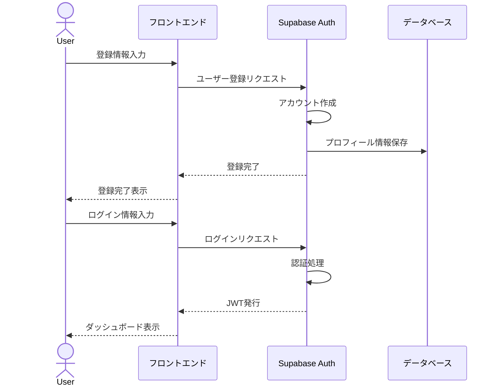
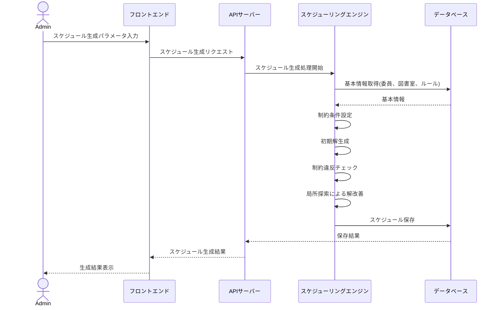
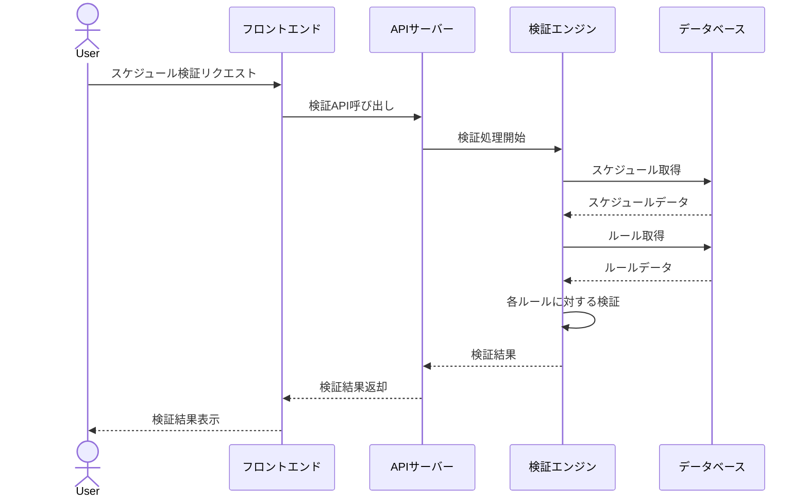

# 図書委員当番割り当てシステム プログラム設計書（第一フェーズ）

## 1. 概要

本書は図書委員当番割り当てシステムの第一フェーズのプログラム設計について記述したものです。システムの主要コンポーネント、処理フロー、インターフェース定義などの詳細を提供します。

## 2. システムアーキテクチャ

### 2.1 全体構成

本システムは以下の3層アーキテクチャで構成されます：

- **プレゼンテーション層**: Next.js + React + TypeScriptによるSPA
- **アプリケーション層**: Supabase Functions + PostgreSQL関数
- **データアクセス層**: PostgreSQL（Supabase提供）

### 2.2 コンポーネント構成

```
+-------------------------+       +------------------------+        +-----------------------+
| プレゼンテーション層      |       | アプリケーション層       |        | データアクセス層        |
| (Next.js + React)       |<----->| (Supabase Functions)   |<------>| (PostgreSQL)          |
|                         |       |                        |        |                       |
| - 認証UI                |       | - 認証サービス           |        | - ユーザーテーブル      |
| - 基本情報管理画面       |       | - 基本情報管理サービス    |        | - 基本情報テーブル群    |
| - スケジュール管理画面   |       | - スケジュール生成サービス |        | - スケジュールテーブル群 |
| - レポート表示画面      |       | - レポート生成サービス    |        | - ストアドプロシージャ   |
+-------------------------+       +------------------------+        +-----------------------+
```

### 2.3 採用技術詳細

| 層 | 技術 | バージョン | 用途 |
|---|------|-----------|------|
| フロントエンド | Next.js | 14.x | Reactアプリケーションフレームワーク |
| フロントエンド | React | 18.x | UIコンポーネントライブラリ |
| フロントエンド | TypeScript | 5.x | 型安全な開発言語 |
| フロントエンド | shadcn/ui | 最新 | UIコンポーネントライブラリ |
| フロントエンド | Tailwind CSS | 3.x | CSSフレームワーク |
| フロントエンド | React Query | 5.x | データフェッチング・状態管理 |
| バックエンド | Supabase | 最新 | BaaS（Backend as a Service） |
| データベース | PostgreSQL | 15.x | リレーショナルデータベース |

## 3. コンポーネント詳細設計

### 3.1 フロントエンドコンポーネント

#### 3.1.1 共通コンポーネント

| コンポーネント名 | 説明 | 主要props/state |
|---------------|------|----------------|
| `AppLayout` | アプリケーション全体のレイアウト | `children`, `title` |
| `Sidebar` | サイドナビゲーション | `activeItem`, `items` |
| `Header` | ヘッダーコンポーネント | `user`, `onLogout` |
| `DataTable` | 汎用データテーブル | `columns`, `data`, `pagination` |
| `FormField` | 汎用フォームフィールド | `label`, `error`, `children` |
| `Modal` | モーダルダイアログ | `isOpen`, `onClose`, `title`, `children` |
| `ConfirmDialog` | 確認ダイアログ | `isOpen`, `onConfirm`, `onCancel`, `message` |
| `Notification` | 通知表示コンポーネント | `type`, `message`, `duration` |

#### 3.1.2 機能別コンポーネント

| コンポーネント名 | 説明 | 主要props/state |
|---------------|------|----------------|
| `LoginForm` | ログインフォーム | `onSubmit`, `isLoading` |
| `RegisterForm` | ユーザー登録フォーム | `onSubmit`, `isLoading` |
| `GradeForm` | 学年情報登録フォーム | `initialData`, `onSubmit` |
| `ClassForm` | クラス情報登録フォーム | `gradeOptions`, `initialData`, `onSubmit` |
| `CommitteeMemberForm` | 図書委員登録フォーム | `classOptions`, `initialData`, `onSubmit` |
| `LibraryForm` | 図書室登録フォーム | `initialData`, `onSubmit` |
| `LibraryAvailabilityForm` | 図書室利用時間設定フォーム | `libraryId`, `initialData`, `onSubmit` |
| `ScheduleRuleForm` | スケジュールルール設定フォーム | `initialData`, `onSubmit` |
| `ScheduleGenerationForm` | スケジュール生成フォーム | `periodOptions`, `onSubmit` |
| `MonthlyCalendar` | 月間カレンダー表示 | `year`, `month`, `assignments` |
| `WeeklySchedule` | 週間スケジュール表示 | `startDate`, `endDate`, `assignments` |
| `ValidationResultView` | 検証結果表示 | `validationResults` |

### 3.2 カスタムフック

| フック名 | 説明 | 戻り値 |
|---------|------|-------|
| `useAuth` | 認証状態管理フック | `{ user, login, logout, register, isLoading, error }` |
| `useGrades` | 学年情報管理フック | `{ grades, addGrade, updateGrade, deleteGrade, isLoading, error }` |
| `useClasses` | クラス情報管理フック | `{ classes, addClass, updateClass, deleteClass, isLoading, error }` |
| `useCommitteeMembers` | 図書委員管理フック | `{ members, addMember, updateMember, deleteMember, isLoading, error }` |
| `useLibraries` | 図書室管理フック | `{ libraries, addLibrary, updateLibrary, deleteLibrary, isLoading, error }` |
| `useScheduleRules` | スケジュールルール管理フック | `{ rules, addRule, updateRule, deleteRule, isLoading, error }` |
| `useSchedule` | スケジュール管理フック | `{ schedule, generateSchedule, validateSchedule, updateAssignment, isLoading, error }` |

### 3.3 主要状態管理

#### 3.3.1 React Query キャッシュ構造

```
- auth
  - user
- grades
  - all
  - [id]
- classes
  - all
  - byGrade[gradeId]
  - [id]
- committeeMembers
  - all
  - byClass[classId]
  - [id]
- libraries
  - all
  - [id]
  - availability[id]
- scheduleRules
  - all
  - [id]
- schedules
  - all
  - [id]
  - assignments[id]
  - validation[id]
```

## 4. API設計

### 4.1 認証API

```typescript
// ユーザー登録
async function registerUser(email: string, password: string, userData: UserData): Promise<AuthResponse> {
  // Supabase Authを使用したユーザー登録
}

// ログイン
async function login(email: string, password: string): Promise<AuthResponse> {
  // Supabase Authを使用したログイン
}

// ログアウト
async function logout(): Promise<void> {
  // Supabase Authを使用したログアウト
}

// パスワードリセット
async function resetPassword(email: string): Promise<void> {
  // Supabase Authを使用したパスワードリセット
}

// ユーザー情報取得
async function getCurrentUser(): Promise<User | null> {
  // 現在のユーザー情報取得
}

// ロール設定
async function setUserRole(userId: string, roleId: number): Promise<void> {
  // ユーザーにロールを設定
}
```

### 4.2 基本情報管理API

```typescript
// 学年情報API
async function getGrades(): Promise<Grade[]> {
  // 学年一覧取得
}

async function createGrade(data: GradeData): Promise<Grade> {
  // 学年情報登録
}

async function updateGrade(id: number, data: GradeData): Promise<Grade> {
  // 学年情報更新
}

async function deleteGrade(id: number): Promise<void> {
  // 学年情報削除
}

// クラス情報API
async function getClasses(gradeId?: number): Promise<Class[]> {
  // クラス一覧取得（学年IDによるフィルタリング可能）
}

async function createClass(data: ClassData): Promise<Class> {
  // クラス情報登録
}

// 図書委員API
async function getCommitteeMembers(classId?: number): Promise<CommitteeMember[]> {
  // 図書委員一覧取得（クラスIDによるフィルタリング可能）
}

async function createCommitteeMember(data: CommitteeMemberData): Promise<CommitteeMember> {
  // 図書委員登録
}

// 図書室API
async function getLibraries(): Promise<Library[]> {
  // 図書室一覧取得
}

async function createLibrary(data: LibraryData): Promise<Library> {
  // 図書室登録
}

async function getLibraryAvailability(libraryId: number): Promise<LibraryAvailability[]> {
  // 図書室利用時間取得
}

async function setLibraryAvailability(libraryId: number, data: LibraryAvailabilityData[]): Promise<LibraryAvailability[]> {
  // 図書室利用時間設定
}
```

### 4.3 スケジュール管理API

```typescript
// スケジュールルールAPI
async function getScheduleRules(): Promise<ScheduleRule[]> {
  // ルール一覧取得
}

async function createScheduleRule(data: ScheduleRuleData): Promise<ScheduleRule> {
  // ルール登録
}

// スケジュールAPI
async function getSchedules(period?: string): Promise<Schedule[]> {
  // スケジュール一覧取得
}

async function generateSchedule(params: ScheduleGenerationParams): Promise<Schedule> {
  // スケジュール生成
}

async function getScheduleAssignments(scheduleId: number, date?: string): Promise<ScheduleAssignment[]> {
  // 割り当て一覧取得
}

async function updateScheduleAssignment(scheduleId: number, assignmentId: number, data: AssignmentUpdateData): Promise<ScheduleAssignment> {
  // 割り当て変更
}

async function validateSchedule(scheduleId: number): Promise<ValidationResult[]> {
  // スケジュール検証
}

// 図書委員当番API
async function getMemberAssignments(memberId: number, period?: string): Promise<ScheduleAssignment[]> {
  // 図書委員の当番取得
}
```

## 5. 主要処理フロー

### 5.1 ユーザー登録・認証フロー



### 5.2 スケジュール生成フロー



### 5.3 スケジュール検証フロー



## 6. エラーハンドリング

### 6.1 フロントエンドエラーハンドリング

```typescript
// グローバルエラーハンドラー
function setupGlobalErrorHandler() {
  window.onerror = (message, source, lineno, colno, error) => {
    // エラーログ送信
    logError({
      type: 'global',
      message: message.toString(),
      source,
      lineno,
      colno,
      stack: error?.stack
    });
    
    // ユーザーへの通知
    showErrorNotification('予期せぬエラーが発生しました。');
    return true;
  };
}

// API通信エラーハンドラー
function handleApiError(error: any) {
  // エラータイプの判別
  if (error.status === 401) {
    // 認証エラー
    redirectToLogin();
  } else if (error.status === 403) {
    // 権限エラー
    showErrorNotification('この操作を行う権限がありません。');
  } else if (error.status === 404) {
    // リソース不存在
    showErrorNotification('リクエストされたリソースが見つかりません。');
  } else if (error.status >= 500) {
    // サーバーエラー
    showErrorNotification('サーバーエラーが発生しました。しばらく経ってからお試しください。');
  } else {
    // その他のエラー
    showErrorNotification(error.message || '通信エラーが発生しました。');
  }
  
  // エラーログ送信
  logError({
    type: 'api',
    status: error.status,
    message: error.message,
    endpoint: error.endpoint,
    request: error.request
  });
}
```

### 6.2 バックエンドエラーハンドリング

```typescript
// エラーレスポンス構造
interface ErrorResponse {
  status: number;
  code: string;
  message: string;
  details?: any;
}

// APIエラーハンドラー
function handleApiError(error: any, res: Response) {
  console.error('API Error:', error);
  
  // エラータイプに応じたレスポンス生成
  if (error.code === 'P2002') {
    // 一意性制約違反
    return res.status(409).json({
      status: 409,
      code: 'CONFLICT',
      message: '既に存在するデータです',
      details: error.meta
    });
  } else if (error.code === 'P2025') {
    // レコード不存在
    return res.status(404).json({
      status: 404,
      code: 'NOT_FOUND',
      message: '指定されたリソースが見つかりません',
      details: null
    });
  } else if (error instanceof ValidationError) {
    // バリデーションエラー
    return res.status(400).json({
      status: 400,
      code: 'VALIDATION_ERROR',
      message: 'バリデーションエラーが発生しました',
      details: error.errors
    });
  } else {
    // その他のエラー
    return res.status(500).json({
      status: 500,
      code: 'INTERNAL_SERVER_ERROR',
      message: '内部サーバーエラーが発生しました',
      details: null
    });
  }
}
```

## 7. テスト計画

### 7.1 単体テスト

- コンポーネントのレンダリングテスト
- カスタムフックのテスト
- ユーティリティ関数のテスト
- APIクライアント関数のテスト
- スケジューリングアルゴリズムのテスト

### 7.2 統合テスト

- ユーザー認証フローのテスト
- 基本情報管理機能のテスト
- スケジュール生成・検証フローのテスト
- APIエンドポイントの動作テスト

### 7.3 E2Eテスト

- ユーザー登録からスケジュール生成までの一連のフロー
- 管理者によるデータ管理フロー
- 一般ユーザーによる当番確認フロー

## 8. パフォーマンス最適化

### 8.1 フロントエンド最適化

- コンポーネントのメモ化
- レンダリングの最適化
- 画像・アセットの最適化
- コード分割とレイジーローディング

### 8.2 バックエンド最適化

- データベースクエリの最適化
- キャッシング戦略
- バッチ処理の活用
- パフォーマンスモニタリング

### 8.3 データベース最適化

- 適切なインデックス設計
- 効率的なテーブル設計
- クエリの最適化
- コネクションプーリング

## 9. セキュリティ対策

### 9.1 認証・認可

- JWT認証の実装
- ロールベースのアクセス制御
- セッション管理
- パスワード強度要件

### 9.2 データ保護

- 機密データの暗号化
- SQLインジェクション対策
- XSS対策
- CSRF対策

### 9.3 監査とログ

- ユーザーアクション監査
- エラーログ
- セキュリティイベントの検知
- 定期的なセキュリティレビュー

## 10. まとめ

本設計書では、図書委員当番割り当てシステムの第一フェーズにおけるプログラム設計の詳細を記述しました。フロントエンドからバックエンド、データベースに至るまでの技術スタック、コンポーネント設計、API設計、処理フロー、エラーハンドリングなどを定義しています。

この設計に基づいて実装を進めることで、要件を満たす高品質なシステムを構築することが可能です。また、第二フェーズ以降の拡張を考慮した拡張性の高い設計となっています。
