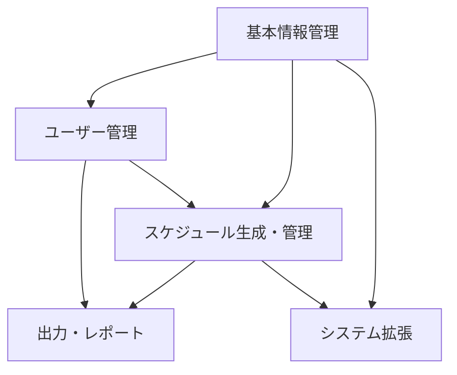
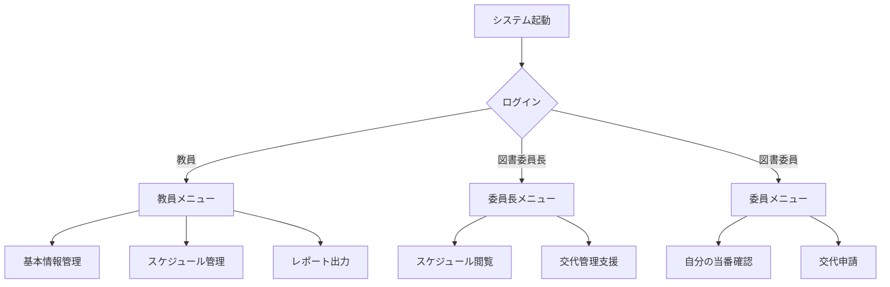

# 統合版機能要件定義

## 目次

1. [はじめに](#はじめに)
2. [概要](#概要)
3. [基本情報管理機能](#基本情報管理機能)
4. [スケジュール生成・管理機能](#スケジュール生成管理機能)
5. [ユーザー機能](#ユーザー機能)
6. [出力・レポート機能](#出力レポート機能)
7. [システム拡張機能](#システム拡張機能)
8. [非機能要件](#非機能要件)
9. [実装計画](#実装計画)
10. [付録：ユーザーストーリー](#付録ユーザーストーリー)

## はじめに

### 背景と目的

本文書は、小学校の図書委員（5年生・6年生）のスケジュール管理アプリケーション開発プロジェクトのための機能要件を定義するものである。現在、図書委員の当番スケジュール作成は手作業で行われており、複雑なルールの適用と公平な割り当てに多大な労力を要している。本システムはこの作業を自動化し、教員の負担軽減と効率的な図書室運営を実現する。

### 図書委員当番ルール

- 5年、6年生が担当
- 各学年は2以上の任意クラスで構成
- 各クラスに2-3人の図書委員が在籍
- 2つの図書室にそれぞれ当番を配置
- 月曜日から金曜日に当番割り当て
- 予定表は、年二回作成し当番を入れ替える
- 前半で水曜・金曜担当の委員は後半で水曜・金曜担当にならない
- 各図書委員は週二回担当
- 同じクラスの図書委員は同じ曜日の担当とならない
- 各学年の委員が均等に配置、曜日によって偏らない

## 概要

### システム全体構成

本システムは以下の5つの主要機能群で構成される：
1. 基本情報管理機能
2. スケジュール生成・管理機能
3. ユーザー機能
4. 出力・レポート機能
5. システム拡張機能

### 機能間の関連性

### ユーザーロールとアクセス権限

1. **システム管理者（教員）**
   - すべての機能へのアクセス権限
   - システム設定の変更権限
   - ユーザー管理権限

2. **図書担当教員**
   - 基本情報管理
   - スケジュール生成・管理
   - 出力・レポート機能

3. **図書委員長**
   - スケジュール閲覧
   - 一部修正提案
   - レポート閲覧

4. **一般図書委員**
   - 自分の当番スケジュール閲覧
   - 交代申請

## 基本情報管理機能

### 1.1 学年・クラス情報管理

#### 1.1.1 学年情報登録

- **目的**: システムで扱う学年情報を登録・管理する
- **入力**: 学年名（5年、6年）
- **出力**: 登録済み学年一覧
- **制約条件**: 学年は5年と6年のみ
- **優先度**: 高（第1フェーズ）

#### 1.1.2 クラス情報登録

- **目的**: 各学年のクラス情報を登録・管理する
- **入力**: 学年ID、クラス名（例：5年1組）
- **出力**: 登録済みクラス一覧
- **制約条件**: 各学年は2クラス以上で構成
- **優先度**: 高（第1フェーズ）

#### 1.1.3 学年・クラス情報一括インポート

- **目的**: CSVファイルから学年・クラス情報を一括登録する
- **入力**: CSVファイル（学年、クラス情報）
- **出力**: インポート結果、エラーログ
- **制約条件**: 指定フォーマットのCSVのみ受付
- **優先度**: 中（第2フェーズ）

### 1.2 図書委員情報管理

#### 1.2.1 図書委員登録

- **目的**: 図書委員の基本情報を登録・管理する
- **入力**: 氏名、学年、クラス、役職（委員長、副委員長、委員）
- **出力**: 登録済み図書委員一覧
- **制約条件**: 各クラス2-3名の図書委員が登録可能
- **優先度**: 高（第1フェーズ）

#### 1.2.2 図書委員一括インポート

- **目的**: CSVファイルから図書委員情報を一括登録する
- **入力**: CSVファイル（図書委員情報）
- **出力**: インポート結果、エラーログ
- **制約条件**: 指定フォーマットのCSVのみ受付
- **優先度**: 中（第2フェーズ）

#### 1.2.3 委員情報変更・休会管理

- **目的**: 年度途中での委員変更や一時休会を管理する
- **入力**: 委員ID、変更内容（退会・休会）、期間
- **出力**: 変更履歴、現在の委員状況
- **制約条件**: 履歴を保持すること
- **優先度**: 中（第2フェーズ）

### 1.3 図書室情報管理

#### 1.3.1 図書室登録

- **目的**: 当番を配置する図書室情報を登録・管理する
- **入力**: 図書室名、場所、収容人数
- **出力**: 登録済み図書室一覧
- **制約条件**: 最低2つの図書室を登録すること
- **優先度**: 高（第1フェーズ）

#### 1.3.2 図書室利用可能時間設定

- **目的**: 各図書室の利用可能曜日・時間帯を設定する
- **入力**: 図書室ID、曜日、開始時間、終了時間
- **出力**: 図書室別利用可能時間一覧
- **制約条件**: 月曜から金曜までの設定が必要
- **優先度**: 高（第1フェーズ）

## スケジュール生成・管理機能

### 2.1 スケジュールルール設定

#### 2.1.1 基本ルール設定

- **目的**: 当番割り当ての基本ルールを設定する
- **入力**: ルール種別、ルール内容、優先度
- **出力**: 設定済みルール一覧
- **制約条件**: すべての図書委員当番ルールを設定可能であること
- **優先度**: 高（第1フェーズ）

#### 2.1.2 例外ルール設定

- **目的**: 特定の委員や曜日に対する例外ルールを設定する
- **入力**: 委員ID、曜日、例外条件
- **出力**: 設定済み例外ルール一覧
- **制約条件**: 基本ルールを上書きする形で適用
- **優先度**: 中（第2フェーズ）

### 2.2 スケジュール自動生成

#### 2.2.1 前期スケジュール生成

- **目的**: 前期（4月〜9月）の当番スケジュールを自動生成する
- **入力**: 生成期間、適用ルール
- **出力**: 前期当番スケジュール
- **制約条件**: すべての当番ルールを満たすこと
- **優先度**: 高（第1フェーズ）

#### 2.2.2 後期スケジュール生成

- **目的**: 後期（10月〜3月）の当番スケジュールを自動生成する
- **入力**: 生成期間、適用ルール、前期スケジュール
- **出力**: 後期当番スケジュール
- **制約条件**: 前期で水曜・金曜担当の委員は後期で水曜・金曜担当にならないこと
- **優先度**: 高（第1フェーズ）

#### 2.2.3 スケジューリングエンジン

- **目的**: 制約充足に基づくスケジュール生成を行う
- **処理内容**:
  - 必須制約: すべての図書委員当番ルール
  - 優先制約: 負荷の均等分散など
  - 解法: バックトラッキング+ヒューリスティック探索（簡略化版）
- **パフォーマンス目標**: 通常規模（50人程度）で30秒以内に解を生成
- **優先度**: 高（第1フェーズ）

### 2.3 スケジュール編集・管理

#### 2.3.1 手動スケジュール調整

- **目的**: 自動生成されたスケジュールを手動で微調整する
- **入力**: 当番ID、変更内容
- **出力**: 更新後のスケジュール
- **制約条件**: 調整後もルール違反がないこと（警告表示）
- **優先度**: 高（第1フェーズ）

#### 2.3.2 当番交代管理

- **目的**: 委員間の当番交代を管理する
- **入力**: 交代元委員ID、交代先委員ID、日付
- **出力**: 交代履歴、更新後のスケジュール
- **制約条件**: 交代履歴を保持し、元の割り当ても確認可能にする
- **優先度**: 中（第2フェーズ）

#### 2.3.3 欠席対応管理

- **目的**: 当番委員の急な欠席に対応する
- **入力**: 欠席委員ID、日付、代替委員ID
- **出力**: 欠席履歴、更新後のスケジュール
- **制約条件**: 緊急度に応じた通知機能を含む
- **優先度**: 中（第2フェーズ）

### 2.4 スケジュール検証

#### 2.4.1 ルール適合性検証

- **目的**: 現在のスケジュールがすべての当番ルールを満たしているか検証する
- **入力**: 検証対象スケジュール
- **出力**: 検証結果、ルール違反箇所
- **制約条件**: すべての当番ルールを検証対象とする
- **優先度**: 高（第1フェーズ）

#### 2.4.2 公平性検証

- **目的**: 当番の割り当てが委員間で公平か検証する
- **入力**: 検証対象スケジュール
- **出力**: 公平性指標、偏りのある委員一覧
- **制約条件**: 曜日による負荷差も考慮すること
- **優先度**: 中（第2フェーズ）

## ユーザー機能

### 3.1 ユーザー管理

#### 3.1.1 ユーザー登録

- **目的**: システム利用者の情報を登録・管理する
- **入力**: ユーザー名、パスワード、役割（教員/図書委員長/図書委員）
- **出力**: 登録済みユーザー一覧
- **制約条件**: パスワードは適切な強度を持つこと
- **優先度**: 高（第1フェーズ）

#### 3.1.2 ログイン・認証

- **目的**: ユーザー認証を行い、適切な権限でシステムを利用できるようにする
- **入力**: ユーザー名、パスワード
- **出力**: 認証結果、セッション情報
- **制約条件**: 失敗回数制限などのセキュリティ対策を含む
- **優先度**: 高（第1フェーズ）

#### 3.1.3 権限管理

- **目的**: ユーザーの役割に応じた機能アクセス権限を管理する
- **入力**: ユーザーID、役割
- **出力**: 権限設定一覧
- **制約条件**: 最小権限の原則に基づく設計
- **優先度**: 高（第1フェーズ）

### 3.2 個人向け機能

#### 3.2.1 自分の当番確認

- **目的**: 図書委員が自分の当番スケジュールを確認する
- **入力**: 図書委員ID
- **出力**: 個人別当番スケジュール
- **制約条件**: 自分の情報のみ閲覧可能
- **優先度**: 高（第1フェーズ）

#### 3.2.2 当番交代申請

- **目的**: 図書委員が当番の交代を申請する
- **入力**: 交代希望日、理由
- **出力**: 申請状況
- **制約条件**: 教員の承認が必要
- **優先度**: 中（第2フェーズ）

### 3.3 通知機能

#### 3.3.1 当番リマインダー

- **目的**: 当番前日や当日に通知を送る
- **入力**: 通知設定（時間、方法）
- **出力**: リマインダー通知
- **制約条件**: 複数の通知方法に対応（画面、メール等）
- **優先度**: 低（第3フェーズ）

#### 3.3.2 スケジュール変更通知

- **目的**: スケジュール変更時に関係者に通知する
- **入力**: 変更内容
- **出力**: 変更通知
- **制約条件**: 影響を受けるユーザーのみに通知
- **優先度**: 中（第2フェーズ）

## 出力・レポート機能

### 4.1 スケジュール表示

#### 4.1.1 月間カレンダー表示

- **目的**: 月単位でのスケジュールをカレンダー形式で表示する
- **入力**: 年月
- **出力**: 月間当番カレンダー
- **制約条件**: 印刷に適した表示形式も提供
- **優先度**: 高（第1フェーズ）

#### 4.1.2 週間スケジュール表示

- **目的**: 週単位でのスケジュールを表示する
- **入力**: 年月日（週の開始日）
- **出力**: 週間当番表
- **制約条件**: 図書室別・曜日別に表示
- **優先度**: 高（第1フェーズ）

#### 4.1.3 クラス別当番表示

- **目的**: クラス単位でのスケジュールを表示する
- **入力**: 学年、クラス
- **出力**: クラス別当番表
- **制約条件**: クラス内の全委員を表示
- **優先度**: 中（第2フェーズ）

### 4.2 レポート生成

#### 4.2.1 当番実績レポート

- **目的**: 期間内の当番実績を集計する
- **入力**: 集計期間、集計単位（委員/クラス/学年）
- **出力**: 当番実績レポート
- **制約条件**: グラフ表示にも対応
- **優先度**: 中（第2フェーズ）

#### 4.2.2 公平性分析レポート

- **目的**: 当番割り当ての公平性を分析する
- **入力**: 分析期間
- **出力**: 公平性分析レポート
- **制約条件**: 曜日別・図書室別の負荷分析を含む
- **優先度**: 低（第3フェーズ）

### 4.3 データエクスポート

#### 4.3.1 スケジュールエクスポート

- **目的**: スケジュールデータを外部形式にエクスポートする
- **入力**: エクスポート期間、形式（CSV/Excel/PDF）
- **出力**: エクスポートファイル
- **制約条件**: 学校での一般的な利用環境を考慮した形式
- **優先度**: 中（第2フェーズ）

#### 4.3.2 印刷用フォーマット出力

- **目的**: 掲示用・配布用の印刷フォーマットで出力する
- **入力**: 出力期間、フォーマット種別
- **出力**: 印刷用PDF
- **制約条件**: A4サイズに最適化された見やすいデザイン
- **優先度**: 高（第1フェーズ）

## システム拡張機能

### 5.1 他委員会対応

#### 5.1.1 委員会テンプレート

- **目的**: 他委員会向けのテンプレートを管理する
- **入力**: 委員会名、ルール設定
- **出力**: 委員会テンプレート
- **制約条件**: 図書委員と異なるルールにも対応可能な柔軟性
- **優先度**: 低（第3フェーズ）

#### 5.1.2 委員会別カスタマイズ

- **目的**: 委員会固有のルールや条件をカスタマイズする
- **入力**: 委員会ID、カスタム設定
- **出力**: カスタマイズされた委員会設定
- **制約条件**: コア機能に影響を与えないモジュール設計
- **優先度**: 低（第3フェーズ）

### 5.2 外部連携

#### 5.2.1 学校カレンダー連携

- **目的**: 学校行事カレンダーとの連携により、休校日などを自動反映する
- **入力**: 外部カレンダーURL
- **出力**: 統合スケジュール
- **制約条件**: 標準的なカレンダー形式（iCal等）に対応
- **優先度**: 低（第3フェーズ）

#### 5.2.2 お知らせ掲示板連携

- **目的**: 学校のお知らせ掲示板との連携により、スケジュール変更などを掲示する
- **入力**: 連携設定、掲示内容
- **出力**: 掲示板投稿
- **制約条件**: シンプルなAPI連携のみ実装
- **優先度**: 低（第3フェーズ）

## 非機能要件

### 6.1 パフォーマンス要件

- スケジュール生成処理: 50人規模で30秒以内に完了
- 画面表示応答時間: 3秒以内
- 同時利用ユーザー: 最大30人程度
- データ処理容量: 年間データで10MB以内

### 6.2 セキュリティ要件

- ユーザー認証: パスワードによる認証
- 権限管理: 役割ベースのアクセス制御
- データ保護: 児童情報の適切な保護
- ログ管理: 重要操作の操作ログ取得

### 6.3 ユーザビリティ要件

- 直感的なUI: コンピュータ操作に不慣れな教員でも利用可能
- レスポンシブ対応: タブレットからの利用も考慮
- ヘルプ機能: 文脈に応じたヘルプ情報の提供
- アクセシビリティ: 色覚多様性への配慮

### 6.4 拡張性・保守性要件

- モジュール設計: 機能追加が容易な構造
- 設定による制御: コード変更なしでのカスタマイズ性
- バックアップ機能: 定期的なデータバックアップ
- 複数年度データ管理: 過去データの参照機能

## 実装計画

### 第1フェーズ（基本機能）

- 基本情報管理機能の実装
- スケジュール生成・管理の基本機能実装
- ユーザー管理の基本機能実装
- 基本的な表示・出力機能実装

### 第2フェーズ（拡張機能）

- 当番交代・欠席管理機能の実装
- 通知機能の実装
- レポート機能の拡充
- データインポート・エクスポート機能の強化

### 第3フェーズ（横展開機能）

- 他委員会対応機能の実装
- 外部システム連携機能の実装
- 高度な分析・最適化機能の追加

## 付録：ユーザーストーリー

### 図書担当教員のストーリー

1. 図書担当教員として、図書委員情報を一括登録したい。なぜなら、手作業での入力は時間がかかるからだ。
2. 図書担当教員として、当番ルールを設定したい。なぜなら、学校独自のルールに合わせたスケジュールが必要だからだ。
3. 図書担当教員として、前期・後期の当番表を自動生成したい。なぜなら、手作業での作成は時間がかかり、ミスが発生するからだ。
4. 図書担当教員として、印刷用の当番表を出力したい。なぜなら、図書室に掲示して全校児童に知らせる必要があるからだ。

### 図書委員長のストーリー

1. 図書委員長として、すべての図書委員のスケジュールを閲覧したい。なぜなら、当番の管理と調整をサポートしたいからだ。
2. 図書委員長として、当番の交代申請を確認したい。なぜなら、円滑な図書室運営をサポートしたいからだ。

### 図書委員のストーリー

1. 図書委員として、自分の当番日を確認したい。なぜなら、いつ図書室当番があるか把握して準備したいからだ。
2. 図書委員として、当番の交代を申請したい。なぜなら、行事や体調不良で当番ができない日があるからだ。

### 学校管理者のストーリー

1. 学校管理者として、システムの利用状況を確認したい。なぜなら、導入効果を評価したいからだ。
2. 学校管理者として、他の委員会にも同様のシステムを展開したい。なぜなら、全校的な業務効率化を図りたいからだ。

