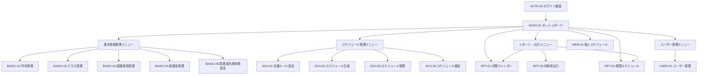

# 図書委員当番割り当てシステム 第一フェーズ実装計画書

## 1. 実装範囲

概要設計書に基づき、第一フェーズでは以下の機能を実装します：

### 1.1 基本情報管理機能
- 学年情報登録 (1.1.1)
- クラス情報登録 (1.1.2)
- 図書委員登録 (1.2.1)
- 図書室登録 (1.3.1)
- 図書室利用可能時間設定 (1.3.2)

> 注: 第一フェーズでは画面からの登録機能のみを実装し、一括インポート機能は第二フェーズで実装します。

### 1.2 スケジュール生成・管理機能
- 基本ルール設定 (2.1.1)
- 前期スケジュール生成 (2.2.1)
- 後期スケジュール生成 (2.2.2)
- スケジューリングエンジン (2.2.3)
- ルール適合性検証 (2.4.1)

### 1.3 ユーザー機能
- ユーザー登録 (3.1.1)
- ログイン・認証 (3.1.2)
- 権限管理 (3.1.3)
- 自分の当番確認 (3.2.1)

### 1.4 出力・レポート機能
- 月間カレンダー表示 (4.1.1)
- 週間スケジュール表示 (4.1.2)

## 2. 実装スケジュール

| 週 | 実装内容 |
|---|---|
| 第1週 | プロジェクト環境構築、データベース設計、共通コンポーネント作成 |
| 第2週 | 基本情報管理機能の実装（学年、クラス、図書委員、図書室管理の画面登録機能） |
| 第3週 | ユーザー管理機能の実装（登録、認証、権限管理） |
| 第4週 | スケジュールルール設定、スケジューリングエンジン実装 |
| 第5週 | スケジュール生成機能の実装（前期・後期）、検証機能 |
| 第6週 | スケジュール表示機能の実装（月間、週間） |
| 第7週 | テスト、バグ修正 |
| 第8週 | ドキュメント作成、リリース準備 |

## 3. システムアーキテクチャ

### 3.1 採用技術

- **フロントエンド**: Next.js + React + TypeScript
- **バックエンド**: Supabase (PostgreSQL + Auth + Storage + Realtime)
- **データベース**: PostgreSQL (Supabase)
- **認証**: Supabase Auth
- **UI フレームワーク**: shadcn/ui + Tailwind CSS
- **状態管理**: React Query
- **テスト**: Jest + React Testing Library
- **デプロイ**: Vercel (フロントエンド) + Supabase (バックエンド)

### 3.2 全体構成図

```
+------------------+       +------------------+       +------------------+
|                  |       |                  |       |                  |
|  クライアント層   |<----->|   バックエンド    |<----->|  データベース層   |
|  (Next.js)       |       |  (Supabase)      |      |  (PostgreSQL)    |
|                  |       |   - Auth         |      |   - テーブル      |
+------------------+       |   - Storage      |      |   - ファンクション  |
                           |   - Realtime     |      |   - ポリシー      |
                           +------------------+      +------------------+
```

## 4. ソース構成

```
tosho-in-wariate-kun/
├── client/                   # フロントエンドソース
│   ├── public/               # 静的ファイル
│   ├── src/                  # ソースコード
│   │   ├── assets/           # 画像・スタイルシート等
│   │   ├── components/       # 共通コンポーネント
│   │   │   ├── common/       # 汎用コンポーネント
│   │   │   ├── layout/       # レイアウト関連コンポーネント
│   │   │   └── forms/        # フォームコンポーネント
│   │   ├── contexts/         # Reactコンテキスト
│   │   ├── hooks/            # カスタムフック
│   │   ├── pages/            # 各ページコンポーネント
│   │   │   ├── auth/         # 認証関連ページ
│   │   │   ├── dashboard/    # ダッシュボード
│   │   │   ├── basicInfo/    # 基本情報管理ページ
│   │   │   ├── schedule/     # スケジュール管理ページ
│   │   │   └── reports/      # レポート・出力ページ
│   │   ├── services/         # APIリクエスト処理
│   │   ├── types/            # 型定義
│   │   ├── utils/            # ユーティリティ関数
│   │   ├── App.tsx           # アプリルートコンポーネント
│   │   └── index.tsx         # エントリーポイント
│   ├── package.json          # パッケージ管理
│   └── tsconfig.json         # TypeScript設定
├── server/                   # バックエンドソース
│   ├── src/                  # ソースコード
│   │   ├── config/           # 設定ファイル
│   │   ├── controllers/      # コントローラー
│   │   ├── middleware/       # ミドルウェア
│   │   ├── models/           # データモデル
│   │   ├── routes/           # APIルーティング
│   │   ├── services/         # ビジネスロジック
│   │   │   └── scheduler/    # スケジューリングエンジン
│   │   ├── types/            # 型定義
│   │   ├── utils/            # ユーティリティ関数
│   │   └── app.ts            # サーバーエントリーポイント
│   ├── database/             # データベース関連
│   │   ├── migrations/       # マイグレーションファイル
│   │   └── seeds/            # シードデータ
│   ├── package.json          # パッケージ管理
│   └── tsconfig.json         # TypeScript設定
├── docs/                     # ドキュメント
├── .gitignore                # Git無視設定
├── package.json              # ルートパッケージ管理
└── README.md                 # プロジェクト説明
```

## 5. データベース設計

### 5.1 テーブル設計 (Supabase)

#### 5.1.1 認証関連テーブル (Supabase Auth)
- `auth.users`: ユーザー認証情報（Supabase組み込み）
- `auth.identities`: 認証プロバイダー情報（Supabase組み込み）
- `auth.sessions`: セッション情報（Supabase組み込み）

#### 5.1.2 アプリケーションスキーマ
```sql
-- プロファイルテーブル (auth.usersと1:1で紐づく)
create table public.profiles (
  id uuid references auth.users on delete cascade not null primary key,
  username text unique,
  full_name text,
  avatar_url text,
  updated_at timestamp with time zone
);

-- ロールテーブル
create table public.roles (
  id bigint generated by default as identity primary key,
  name text not null unique,
  description text,
  created_at timestamp with time zone default now()
);

-- ユーザーロール関連付け
create table public.user_roles (
  id bigint generated by default as identity primary key,
  user_id uuid references auth.users on delete cascade not null,
  role_id bigint references public.roles on delete cascade not null,
  created_at timestamp with time zone default now(),
  unique(user_id, role_id)
);

-- 学年テーブル
create table public.grades (
  id bigint generated by default as identity primary key,
  name text not null,
  year integer not null,
  created_at timestamp with time zone default now()
);

-- クラステーブル
create table public.classes (
  id bigint generated by default as identity primary key,
  grade_id bigint references public.grades on delete cascade not null,
  name text not null,
  created_at timestamp with time zone default now(),
  unique(grade_id, name)
);

-- 役職テーブル
create table public.positions (
  id bigint generated by default as identity primary key,
  name text not null unique,
  description text,
  created_at timestamp with time zone default now()
);

-- 図書委員テーブル
create table public.committee_members (
  id bigint generated by default as identity primary key,
  profile_id uuid references public.profiles on delete set null,
  name text not null,
  class_id bigint references public.classes on delete set null,
  position_id bigint references public.positions on delete set null,
  is_active boolean default true,
  created_at timestamp with time zone default now(),
  updated_at timestamp with time zone
);

-- 図書室テーブル
create table public.libraries (
  id bigint generated by default as identity primary key,
  name text not null,
  location text,
  capacity integer,
  created_at timestamp with time zone default now()
);

-- 図書室利用可能時間
create table public.library_availability (
  id bigint generated by default as identity primary key,
  library_id bigint references public.libraries on delete cascade not null,
  day_of_week integer not null, -- 0: 日曜日 〜 6: 土曜日
  start_time time not null,
  end_time time not null,
  unique(library_id, day_of_week)
);

-- スケジュールルール
create table public.schedule_rules (
  id bigint generated by default as identity primary key,
  name text not null,
  description text,
  rule_type text not null, -- 'required', 'preferred', 'forbidden' など
  priority integer default 0,
  parameters jsonb,
  created_at timestamp with time zone default now()
);

-- スケジュール
create table public.schedules (
  id bigint generated by default as identity primary key,
  name text not null,
  description text,
  start_date date not null,
  end_date date not null,
  is_published boolean default false,
  created_by uuid references auth.users on delete set null,
  created_at timestamp with time zone default now(),
  updated_at timestamp with time zone
);

-- スケジュール割り当て
create table public.schedule_assignments (
  id bigint generated by default as identity primary key,
  schedule_id bigint references public.schedules on delete cascade not null,
  committee_member_id bigint references public.committee_members on delete cascade not null,
  library_id bigint references public.libraries on delete cascade not null,
  date date not null,
  time_slot text not null, -- 'morning', 'afternoon' など
  notes text,
  created_at timestamp with time zone default now(),
  updated_at timestamp with time zone,
  unique(schedule_id, library_id, date, time_slot)
);

-- スケジュール例外
create table public.schedule_exceptions (
  id bigint generated by default as identity primary key,
  schedule_id bigint references public.schedules on delete cascade not null,
  committee_member_id bigint references public.committee_members on delete cascade,
  date date not null,
  reason text,
  created_at timestamp with time zone default now()
);

-- スケジュール変更履歴
create table public.schedule_change_logs (
  id bigint generated by default as identity primary key,
  schedule_id bigint references public.schedules on delete cascade not null,
  assignment_id bigint references public.schedule_assignments on delete cascade,
  change_type text not null, -- 'create', 'update', 'delete', 'swap', 'exception'
  changed_by uuid references auth.users on delete set null,
  previous_values jsonb,
  new_values jsonb,
  created_at timestamp with time zone default now()
);

-- 行レベルセキュリティ (RLS) ポリシー
-- プロファイルテーブルのRLSを有効化
alter table public.profiles enable row level security;

-- プロファイルのRLSポリシー
create policy "プロファイルは自分のもののみ閲覧可能"
  on public.profiles for select
  using (auth.uid() = id);

create policy "ユーザーは自分のプロファイルを更新可能"
  on public.profiles for update
  using (auth.uid() = id);

-- 他のテーブルにも適切なRLSポリシーを追加...
```

### 5.2 データベース関数

```sql
-- スケジュール生成関数
create or replace function public.generate_schedule(
  p_schedule_id bigint,
  p_start_date date,
  p_end_date date,
  p_committee_member_ids bigint[]
) returns void language plpgsql as $$
declare
  v_date date;
  v_day_of_week integer;
  v_available_libraries bigint[];
  v_available_members bigint[];
  -- その他の変数宣言
begin
  -- スケジュール生成ロジックを実装
  -- 1. 指定期間の各日付をループ
  -- 2. 各日付の利用可能な図書室と委員を取得
  -- 3. 割り当てルールに基づいて委員を割り当て
  -- 4. 割り当て結果をschedule_assignmentsに保存
  -- 5. 変更履歴をschedule_change_logsに記録
end;
$$;

-- スケジュール検証関数
create or replace function public.validate_schedule(
  p_schedule_id bigint
) returns table(
  rule_name text,
  description text,
  is_violated boolean,
  details jsonb
) language plpgsql as $$
begin
  -- スケジュールの妥当性を検証するロジックを実装
  -- 各ルールに対してチェックを行い、違反があれば結果を返す
  return query
  with rule_checks as (
    -- 各ルールに対するチェックを結合
    -- 例: 1人の委員が1日に複数回割り当てられていないか
    select 
      'single_assignment_per_day' as rule_name,
      '1人の委員は1日に1回のみ割り当て可能' as description,
      count(*) > 1 as is_violated,
      jsonb_build_object(
        'committee_member_id', sa.committee_member_id,
        'date', sa.date,
        'assignments', jsonb_agg(sa.id)
      ) as details
    from public.schedule_assignments sa
    where sa.schedule_id = p_schedule_id
    group by sa.committee_member_id, sa.date
    having count(*) > 1
    
    union all
    
    -- 他のルールチェックを追加...
  )
  select * from rule_checks
  where is_violated = true;
end;
$$;
```

### 5.3 リアルタイムサブスクリプション

```typescript
// スケジュール変更のリアルタイム購読
const handleScheduleChanges = () => {
  const subscription = supabase
    .channel('schema-db-changes')
    .on(
      'postgres_changes',
      {
        event: '*',
        schema: 'public',
        table: 'schedule_assignments',
        filter: `schedule_id=eq.${scheduleId}`
      },
      (payload) => {
        console.log('Change received!', payload);
        // スケジュールを再取得するか、UIを更新
        fetchSchedule();
      }
    )
    .subscribe();

  return () => {
    supabase.removeChannel(subscription);
  };
};
```

### 5.4 ストレージバケット

- **templates**: スケジュールテンプレートファイルの保存
- **exports**: エクスポートされたスケジュールファイルの保存
- **avatars**: ユーザーアバター画像の保存

```sql
-- ストレージバケットの作成
insert into storage.buckets (id, name, public) 
values ('templates', 'templates', false);

insert into storage.buckets (id, name, public) 
values ('exports', 'exports', true);

insert into storage.buckets (id, name, public) 
values ('avatars', 'avatars', true);

-- アバター画像のアップロードポリシー
create policy "誰でもアバターを閲覧可能"
on storage.objects for select
to authenticated, anon
using (bucket_id = 'avatars');

create policy "ユーザーは自分のアバターをアップロード可能"
on storage.objects for insert
to authenticated
with check (bucket_id = 'avatars' and (storage.foldername(name))[1] = auth.uid()::text);

create policy "ユーザーは自分のアバターを更新可能"
on storage.objects for update
to authenticated
using (bucket_id = 'avatars' and (storage.foldername(name))[1] = auth.uid()::text);

create policy "ユーザーは自分のアバターを削除可能"
on storage.objects for delete
to authenticated
using (bucket_id = 'avatars' and (storage.foldername(name))[1] = auth.uid()::text);
```
        int priority
        boolean is_active
    }
    
    SCHEDULE_RULE_PARAMETERS {
        int id PK
        int rule_id FK
        string param_key
        string param_value
    }
    
    SCHEDULES {
        int id PK
        string name
        date start_date
        date end_date
        string period_type
        datetime created_at
    }
    
    SCHEDULE_ASSIGNMENTS {
        int id PK
        int schedule_id FK
        int member_id FK
        int library_id FK
        date assignment_date
        boolean is_manual_override
    }
```

## 6. 画面設計

### 6.1 画面一覧

| 画面ID | 画面名 | 説明 | アクセス権限 |
|--------|------|------|------------|
| AUTH-01 | ログイン画面 | システムへのログイン | 全ユーザー |
| DASH-01 | ダッシュボード | システム概要・メニュー | 全ユーザー |
| BASIC-01 | 学年管理 | 学年情報の登録・編集 | 教員 |
| BASIC-02 | クラス管理 | クラス情報の登録・編集 | 教員 |
| BASIC-03 | 図書委員管理 | 図書委員の登録・編集 | 教員 |
| BASIC-04 | 図書室管理 | 図書室情報の登録・編集 | 教員 |
| BASIC-05 | 図書室利用時間設定 | 図書室の利用可能時間設定 | 教員 |
| SCH-01 | 当番ルール設定 | スケジュールルールの設定 | 教員 |
| SCH-02 | スケジュール生成 | 前期・後期スケジュール生成 | 教員 |
| SCH-03 | スケジュール管理 | スケジュールの管理・調整 | 教員 |
| SCH-04 | スケジュール検証 | ルール適合性検証 | 教員 |
| USER-01 | ユーザー管理 | ユーザーの登録・編集 | 管理者 |
| RPT-01 | 月間カレンダー | 月間スケジュール表示 | 全ユーザー |
| RPT-02 | 週間スケジュール | 週間スケジュール表示 | 全ユーザー |
| RPT-03 | 印刷用出力 | 印刷用フォーマット出力 | 教員・委員長 |
| MEM-01 | 個人スケジュール | 自分の当番確認 | 図書委員 |

### 6.2 画面遷移図



## 7. API設計

### 7.1 認証API

| エンドポイント | メソッド | 説明 | リクエスト | レスポンス |
|--------------|--------|------|-----------|-----------|
| /api/auth/login | POST | ログイン認証 | username, password | token, user情報 |
| /api/auth/logout | POST | ログアウト | token | 成功メッセージ |
| /api/auth/me | GET | 現在のユーザー情報取得 | token | user情報 |

### 7.2 基本情報管理API

| エンドポイント | メソッド | 説明 | リクエスト | レスポンス |
|--------------|--------|------|-----------|-----------|
| /api/grades | GET | 学年一覧取得 | - | 学年リスト |
| /api/grades | POST | 学年登録 | 学年情報 | 登録結果 |
| /api/grades/:id | PUT | 学年更新 | 学年情報 | 更新結果 |
| /api/grades/:id | DELETE | 学年削除 | - | 削除結果 |
| /api/classes | GET | クラス一覧取得 | ?gradeId | クラスリスト |
| /api/classes | POST | クラス登録 | クラス情報 | 登録結果 |
| /api/members | GET | 図書委員一覧取得 | ?classId | 図書委員リスト |
| /api/members | POST | 図書委員登録 | 図書委員情報 | 登録結果 |
| /api/libraries | GET | 図書室一覧取得 | - | 図書室リスト |
| /api/libraries | POST | 図書室登録 | 図書室情報 | 登録結果 |
| /api/libraries/:id/availability | GET | 図書室利用時間取得 | - | 利用時間リスト |
| /api/libraries/:id/availability | POST | 図書室利用時間設定 | 利用時間情報 | 登録結果 |

### 7.3 スケジュール管理API

| エンドポイント | メソッド | 説明 | リクエスト | レスポンス |
|--------------|--------|------|-----------|-----------|
| /api/rules | GET | ルール一覧取得 | - | ルールリスト |
| /api/rules | POST | ルール登録 | ルール情報 | 登録結果 |
| /api/schedules | GET | スケジュール一覧取得 | ?period | スケジュールリスト |
| /api/schedules | POST | スケジュール生成 | 生成パラメータ | 生成結果 |
| /api/schedules/:id/assignments | GET | 割り当て一覧取得 | ?date | 割り当てリスト |
| /api/schedules/:id/assignments/:assignId | PUT | 割り当て変更 | 変更情報 | 変更結果 |
| /api/schedules/:id/validate | POST | スケジュール検証 | - | 検証結果 |

### 7.4 ユーザー管理API

| エンドポイント | メソッド | 説明 | リクエスト | レスポンス |
|--------------|--------|------|-----------|-----------|
| /api/users | GET | ユーザー一覧取得 | - | ユーザーリスト |
| /api/users | POST | ユーザー登録 | ユーザー情報 | 登録結果 |
| /api/users/:id/roles | GET | ユーザーロール取得 | - | ロールリスト |
| /api/users/:id/roles | POST | ユーザーロール設定 | ロール情報 | 設定結果 |
| /api/members/:id/assignments | GET | 図書委員の当番取得 | ?period | 当番リスト |

## 8. スケジューリングエンジン設計

### 8.1 アルゴリズム概要

スケジューリングエンジンは以下のアプローチで実装します：

1. **制約定義**
   - 必須制約（違反不可）
   - 優先制約（可能な限り満たす）

2. **割り当てアルゴリズム**
   - 初期解生成（曜日ごとに図書委員を仮割り当て）
   - 制約違反チェック
   - 局所探索による解の改善

3. **最適化基準**
   - 全必須制約の充足
   - 優先制約の充足度最大化
   - 当番負荷の公平性

### 8.2 主要クラス構成

- `ScheduleGenerator`: スケジュール生成の統括クラス
- `ConstraintManager`: 制約条件の管理クラス
- `Assignment`: 割り当てを表現するクラス
- `Schedule`: スケジュール全体を表現するクラス
- `Validator`: スケジュールの妥当性検証クラス

## 9. 非機能要件対応

### 9.1 パフォーマンス対策

- スケジュール生成処理の最適化
- データベースインデックス設計
- フロントエンドのレンダリング最適化

### 9.2 セキュリティ対策

- JWT認証の実装
- パスワードのハッシュ化保存
- API入力値のバリデーション
- CSRF対策

### 9.3 テスト計画

- 単体テスト: 各コンポーネント・関数の動作検証
- 統合テスト: API全体の動作検証
- E2Eテスト: 主要ユースケースの動作検証

## 10. まとめ

第一フェーズでは図書委員当番割り当てシステムの基本機能を実装し、学校現場で即活用できるレベルを目指します。UI設計は直感的で操作しやすいものとし、スケジューリングエンジンは現場のルールを正確に反映できる柔軟性を持たせます。今後の第二・第三フェーズでの拡張を考慮した拡張性の高い設計を心掛けます。
